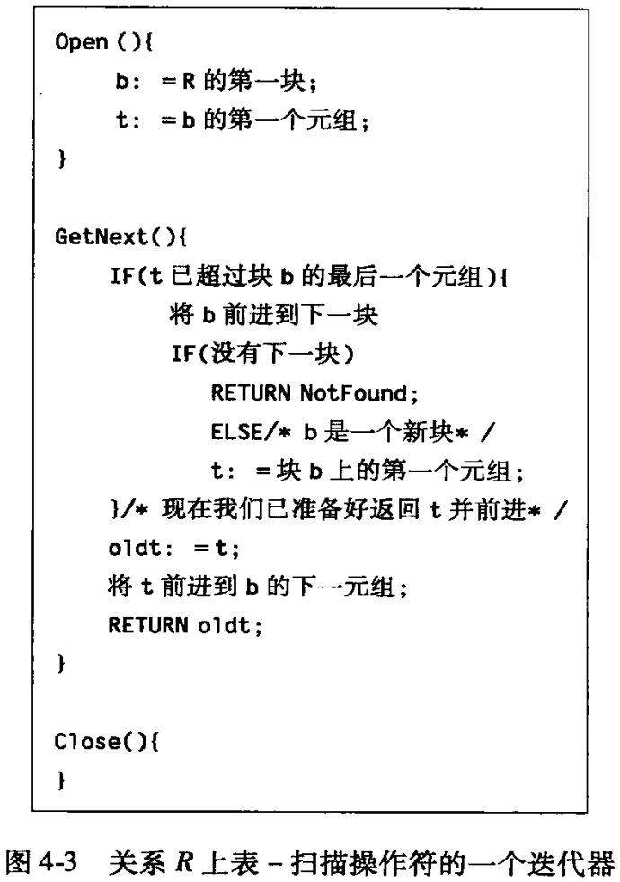

# 第四章 查询执行

*查询处理器*是 DBMS 中的一个部件集合，它能够将用户的查询和数据修改命令转变为数据库上的操作序列并且执行这些操作。

> 物理操作符同物理算子，若无特别强调，算子默认是指物理算子。

## 4.1 物理查询计划操作符介绍

物理计划由（物理）算子 (operator) 构成，每个算子实现计划中的一步。物理算子常常是关系代数操作符的特定的实现。但是，也有物理算子是完成与关系代数运算符无关的任务。例如“扫描”一个表，就是将作为一个关系代数表达式的操作对象的某个关系的每个元组调入内存。该关系是对某个其他的操作的典型操作数。

另外还有“迭代器”的概念，它是使包含在一个物理计划中的算子之间能够传递对元组的请求及结果的一个重要方法。

### 4.1.1 扫描表

读取关系 $R$ 的整个内容可能是物理计划中最简单的工作，读取时还能包含一个简单的谓词来读出满足条件的元组。定位 $R$ 中元组的基本方法有两种：

1. 关系存放在二级存储器的某个区域，它的元组排放在块中。系统知道包含这些元组的块，并且能一个一个得到这些块。该操作叫做*表扫描* (table scan) 。
2. 若关系的任意一个属性上有索引，就可使用索引来得到所有元组。该操作叫做*索引扫描* (index scan) 。

### 4.1.2 扫描表时的排序

有很多原因促使在扫描时对元组进行排序。如查询中包含 ORDER BY 子句，此外，关系的代数操作的许多种算法要求一个或所有的操作对象是排序的关系。

物理算子*排序扫描* (sort scan) 接受关系 $R$ 和作为排序依据的属性组的说明，并产生排好序的 $R$ 。实现排序所秒的方法有多种。若想产生按照属性 $a$ 排序的关系 $R$ ，并且 $a$ 上有一个 *B-Tree* 索引或 $R$ 是按 $a$ 排序的索引顺序文件来存储的，那么对索引进行扫描就可得到排好序的 $R$ 。如果排好序的关系很小，可以装进内存，那么可以使用表扫描或索引扫描得到其元组，在使用贮存排序算法。若 $R$ 太大装不进内存，那么可以使用多路归并方法。

### 4.1.3 物理操作符计算模型

一个查询通常包括几个关系代数操作，相应的物理计划有几个物理操作符组成。必须能够评估使用的每个操作符的“代价”。之后将使用磁盘 I/O 的数目作为衡量每个操作的代价的标准。

在比较相同操作的算法时，将会做一个假设：

- 假设任何操作符的操作对象都位于磁盘上，但操作符的结果存放在内存中。

若操作符产生一个查询的最终结果，该结果序写到磁盘上，那么保存结果的代价仅依赖于结果的大小而无关乎结果的计算方式。可简单的将最后的回写代价加到查询的总代价上。总之，结果写的代价不会影响对于查询执行操作算法的选择。

同样的，形成一个查询的部分（而非整个查询）的操作符的结果通常也不写到磁盘上。这就为传递中间结果的“迭代器”提供了优化空间——把上个操作符的结果写到磁盘，再从磁盘读取传递给下个操作符。

4.1.4 衡量代价的参数

需要一个参数来表达操作符使用的内存大小，还需要其它参数来衡量它的操作对象的大小。假设内存被分成缓冲区，缓冲区的大小与磁盘快相同。那么 *M* 表示一个特定的操作符执行是可以获得的内存缓冲区的数目。一个操作可得到的缓冲区的数目可能不是一个可以预计的常数。这样， *M* 实际上是对一个操作可得到的缓冲区数目的估计。

接下来考虑衡量和访问相关的关系所需代价的参数（用作衡量关系的数据多少和分布）。这里做一假设，即在磁盘上一次访问一个块的数据。有三类参数 *B* 、 *T* 和 *V* ：

- 当描述关系 *R* 的大小时，绝大多是时候关系的是包含所有元组所需的块的数目。这个数目表示为 $B(R)$ 。通常，假设 *R* 是*聚集的* (clustered) ，即 *R* 存储在 *B* 个块中或近似 *B* 个块中。
- 有时，也需要知道 *R* 中的元组的数目，这个数量表示为 $T(R)$ 。若需要知道一个块中能容纳的 *R* 的元组数，可使用比例式 $T/B$ 。
- 最后，有时希望参考出现在关系 *R* 的一个列中的不同值的数目。如果 *a* 是关系的一个属性，那么 $V(R,a)$ 是 *R* 中 *a* 对应列上不同值的数目。更一般地，若 $[a_1,a_2,\dotsm,a_n]$ 是一个属性列表，那么 $V(R,[a_1,a_2,\dotsm,a_n])$ 是 *R* 中属性 $a_1,a_2,\dotsm,a_n$ 对应列上不同的 *n-tuple* 的数目。换言之，是 $\delta(\pi_{a_1,a_2,\dotsm,a_n}(R))$ 中的元组数。

4.1.5 扫描操作符的 I/O 代价

如果关系 *R* 是聚集的，那么表扫描的磁盘 I/O 数目近似为 *B* 。如果关系能装入内存，那么可以将关系读进内存并作内存排序，从而实现排序扫描，所需的磁盘 I/O 仍然是 *B* 。

如果 *R* 不是聚集的，比如 R 分布在其他关系的元组之间，那么所需磁盘 I/O 数可能与 *R* 的元组一样多，即 I/O 代价为 *T* 。类似地，若想把 *R* 排序，但是 *R* 能被内存容纳，那么调入内存的磁盘 I/O 数就是 *T* 。

对于索引扫描，通常关系 *R* 的索引需要的块数比 $B(R)$ 少许多，因此，扫描整个 R 比查看整个索引需要更多 I/O 。这样，即使索引扫描即需要检查关系有需要检查其索引：

- 仍继续用 *B* 或 *T* 作为使用索引时访问整个聚集或不聚集的关系的代价估计。

有时不止想查看 R 的一部分，这其实通常能够避免查看整个索引和整个 *R* 。

4.1.6 实现物理操作符的迭代器

许多物理算子可实现为*迭代器* (iterator) ——允许物理算子结果的接收者能每次一个元组地得到这个结果。迭代器是三个方法的组合：

1. Open() 。该方法启动获得元组的过程，但并不获得元组。它初始化执行操作所需的任何数据结构并为操作的任何操作对象调用 Open() 。
2. GetNext() 。该方法返回结果中的下个元组，并对数据结构作必要的调整以得到后续元组。在获取结果的下一元组时，它通常在操作对象上一次或更多次地调用 GetNext() 。如果再也没有元组返回了，就返回一个没有元组了的标志。
3. Close() 。该方法在所有的元组或使用这项得到的所有元组都获得后中介迭代。它通常为算子的每个操作对象调用 Close() 。

例：简单的 table scan 迭代器示例



例：稍微复杂的 sort scan 迭代器示例。排序扫描要求返回排好序的关系的元组，在检查完每一个元组之前无法返回任何数据。假设关系足够小，能够装进内存。 Open() 可能会对元组进行排序， GetNext() 只需依次返回元组即可。Open() 也可能不对元组排序，由 GetNext() 对剩下的第一个元组进行选择，执行一趟的选择排序操作。

例：多个迭代器调用其他迭代器而结合起来的示例。要实现的是包并 $R \cup S$ 操作的迭代器。可以首先获取 R 的所有元组，再获取 S 的所有元组，不必考虑是否存在重复。使用 $R$ 和 $S$ 表示生成关系 $R$ 和 $S$ 的迭代器，因此它们是查询计划中并操作的子节点。若 $R$ 和 $S$ 是存储的关系，那么迭代器 $R$ 和 $S$ 可能是施加在 $R$ 和 $S$ 上的 table scan 操作，否则可能是调用其他迭代器的网络来计算 $R$ 和 $S$ 的迭代器。


## 4.2 一趟算法

现在介绍查询优化中的一个非常重要的问题：怎样执行逻辑计划中的每个单独的步骤（如连接或选择）。每个操作符的算法的选择是将逻辑计划转为物理计划过程中的一个必不可少的部分。关于各种操作符的算法大体分为三类：

1. 基于排序的方法（ 4.4 节）
2. 基于三列的方法（ 4.5 节、 9.1 节）
3. 基于索引的方法（ 4.6 节）

- 一些方法仅从磁盘读取一次数据，这就是*一趟* (one-pass) 算法。这通常要求操作的至少一个操作对象能完全装入内存，但也存在例外，尤其是接下来将介绍的选择和投影。
- 一些方法处理的数据量太大以至于不能装入可用的内存，但又不是可想象的最大的数据集合。这些*两趟*算法的特点是首先从磁盘读一遍数据，用某种方式处理，将全部或绝大部分写回磁盘，然后再第二趟中为了进一步处理，再读一遍数据。
- 某些方法对处理的数据量没有限制。这些方法用三趟或更多趟来完成工作，它们是对两趟算法的自然的递归的推广。

无论是几趟算法，都将把操作符分为三大类：

1. *一次单个元组，一元操作。*这类操作（选择和投影）无需一次在内存中装入整个关系，甚至也不需要关系的大部分。这样，就能一次读一个块，使用内存缓冲区，并产生所需输出。
2. *整个关系，一元操作。*这些单操作对象的操作需要一次从内存中看到所有或大部分元组，因此一趟算法局限于大小约为 $M$ （内存中可用缓冲区的数量）或更小的关系。此处属于这类操作的事 $\gamma$ （分组操作符）和 $\delta$ （去重操作符）。
3. *整个关系，二元操作。*其他所有的操作可以归为这一类：并、交、差、连接和积的集合形式以及包形式。我们将发现如果要用一趟算法，那么这类操作中的每一个都要求至少一个操作对象的大小限制在 $M$ 以内。

### 4.2.1 一个单个元组操作的一趟算法

如图所示的，一次读取 $R$ 的一块到输入缓冲区，对每个元组进行操作，并将选出的元组或投影的元组放到输出缓冲区。因为输出缓冲区是另一个操作的输入缓冲区或正在向用户或应用发送数据，所以输出缓冲区不算在所需空间内。因此无论 $B$ 有多大，只要求输入缓冲区满足 $M \ge 1$ 。


这一过程的磁盘 I/O 需求取决于作为操作对象的关系 $R$ 是怎样提供的。若 $R$ 最初在磁盘上，那么代价就是执行一个表扫描或索引扫描所需的代价（在 4.1.5 节讨论过）。然而，当执行的操作时一个选择，且其条件是比较一个常量和一个带索引的属性时，这是一个重要的例外。在此情况下，可用索引来检索 $R$ 所在块的一个自己，这通常将显著提高执行效率。

### 4.2.2 整个关系的一元操作的一趟算法

现在考虑施加于整个关系而非单个元组的 $\gamma$ 和 $\delta$ 操作。

#### 消除重复

消除重复元组势必要对已检索的元组进行记录，每次检索元组时就要和记录过的元组做对比，如果和记录的元组都不相同就输出它并把它的一个副本也加入到记录元组的列表中，如若不然就忽略它并检索下一个元组。

如下图所示，用一个内存缓冲区保存 $R$ 的元组的一个块，其余的 $M - 1$ 个缓冲区可以用作记录元组的列表。


然而，若内存中有 $n$ 个元组，每个新元组占用的处理器时间与 $n$ 成比例。因此整个操作占用的处理器时间与 $n^2$ 成比例。由于 $n$ 可能很大，对于假设只有磁盘 I/O 需要大量时间来说，这样的时间量将带来严重问题。鉴于此，需要一个高效的内存结构，能够向其中加入新元组并辨别给定元组是否存在（例如某种三列表或平衡二叉查找树）。以散列表为例，除了元组本身的空间外，还需要额外的空间开销，但由于比较小所以忽略它。基于这个假设，可以在主存的 $M - 1$ 个可用缓冲区存储与 $R$ 的 $M - 1$ 个块所能容纳的一样多的元组。如果期望 $R$ 的每个不同元组的副本能装在主存，那么 $B(\delta(R))$ 肯定不能超过 $M - 1$ 。因为预计 $M$ 远大于 1 ，将经常用到的这个规则的一个简单近似是： $B(\delta(R)) \le M$ 。注意在没有计算出 $\delta(R)$ 本身时，不能一般地计算出 $\delta(R)$ 的大小。如果低估了这个大小，因为保存 $R$ 中不同元组的块必须频繁地出入主存。

#### 分组

分组操作 $\gamma_L$ 提供了零个或多个分组属性以及可能的一个或多个聚集属性。如果在主存中为每个组（也就是为分组属性的每一个值）创建一个项，那么就可以一次一块地扫描 $R$ 的元组。每个组的*项*包括分组属性的值和每个聚集的一个或多个累积值。如下：

- 对 MIN(a) 或 MAX(a) 聚集来说，分别记录组内迄今为止见到的任意元组在属性 $a$ 上的最小或最大值。当每见到组内一个元组时，如果合适，就改变这个最大值或最小值。
- 对于任意 COUNT 聚集来说，为组中见到的每个元组加 1 。
- 对 SUM(a) 来说，若 $a$ 不为 NULL 的话，在它的组里扫描到的累加值上增加属性 $a$ 的值。
- AVG(a) 的情况复杂。必须保持两个累计值：组内元组的个数以及这些元组在 $a$ 上的值的和。二者的计算分别与前面提到的相同。当关系中所有的元组都被扫描后，计算总和和个数的商以得到平均值。

当关系全部元组都读到缓冲区中，并且已用于各组中聚集的计算，就可以通过为每个组写一个元组来产生输出。直到扫描最后一个元组后，才开始为 $\gamma$ 操作创建输出。因此这种算法不太适合迭代器结构。

为了元组在内存中处理的更高效，同样需要一个好的内存数据结构来在已知分组属性值时找到各分组的项。就如前面讨论的 $\delta$ 操作那样。

这个一趟算法所需磁盘 I/O 数是 $B$ ，与任何一元运算的一趟算法相同。尽管通常情况下 $M$ 将小于 $B$ ，但所需内存缓冲区数 $M$ 与 $B$ 的关系不是任何一种简单的形式。

### 4.2.3 二元操作的一趟算法 （One-Pass Algorithms）

为了区分二元操作（并、交、差、积和连接）对集合和包的版本，使用 $B$ 和 $S$ 来分别表示包和集合。包的并可通过一种很简单的一趟算法计算出来（如同 之前介绍的）。其他的二元操作需将 $R$ 和 $S$ 中较小的操作数读取到内存中并建立适当的内存数据结构，就像 4.2.2 节介绍的那样使得元组可以快速插入和检索。因此，在关系 $R$ 和 $S$ 上用一趟执行一个二元操作的近似需求是： $min(B(R),B(S)) \le M$ 。更精确地说，一个缓冲区被用来读取较大关系的块，而大约 $M$ 个缓冲区用来容纳整个较小的关系和它的内存数据结构。

在以下各种情况中，假定 $R$ 是两个关系中较大的一个，并且将把 $S$ 放入内存中。

#### 集合并

首先把 $S$ 读到内存 $M - 1$ 个缓冲区并建立关键字是整个元组的查找结构。然后一次一块地将 $R$ 的每一块读取到第 $M$ 个缓冲区。对于 $R$ 的每一个元组 $t$ ，如果 $t$ 不在 $S$ 中，则把它输出，如果 $t$ 在 $S$ 中，则跳过。

#### 集合交

首先把 $S$ 读到内存 $M - 1$ 个缓冲区并建立关键字是整个元组的查找结构。读取 $R$ 的每一个块，并且对于 $R$ 的每一个元组 $t$ ，如果 $t$ 在 $S$ 中，则输出它，否则忽略它。

#### 集合差

差不是一种可交换的运算，那么就需要考虑 $R -_S S$ 和 $S -_S R$ 两种情况，这两种情况均假设 $R$ 是较大的那个关系。首先将  $S$ 读到内存 $M - 1$ 个缓冲区并建立关键字是整个元组的查找结构。

为了计算 $R -_S S$ ，读取 $R$ 的每一个块，并且对于 $R$ 的每一个元组 $t$ ，如果 $t$ 在 $S$ 中，则忽略它，否则输出它。为了计算 $S -_s R$ ，读取 $R$ 的每一个块，对于 $R$ 中的每个元组 $t$ ，如果 $t$ 在 S 中，则在主存的 $S$ 的副本里删去元组 $t$ ，反之，若 $t$ 不再 $S$ 中，则忽略它，最后输出主存里 $S$ 剩余的哪些元组。

#### 包交

将 $S$ 读取到 $M - 1$ 个缓冲区中，但是对 $S$ 中每一个不同的元组额外记录其出现的次数，对于多次出现的元组 $t$ ，只是增加其出现次数，而不是存储 $t$ 重复的副本。如果重复很少的话，这种结构将占用比 $B(S)$ 块稍大的空间，尽管结果通常是 $S$ 被压缩。因此，我们继续假设 $B(S) \le M - 1$ 足以运行一趟算法，尽管这个假设只是近似。

然后，在读取 $R$ 每个块时，对其每一个元组 $t$ ，如果 $t$ 没出现在 $S$ 中，则忽略它，反之，如果 $t$ 出现在 $S$ 中，并且与 $t$ 对应的计数器为正值，则输出 $t$ 并将其计数器减 1 。如果 $t$ 出现在 $S$ 中，但是其计数器已经到零，则忽略它。这时输出已产生的 $t$ 的副本和 $S$ 中一样多。

#### 包差

为了计算 $S -_B R$ ，将 $S$ 读到内存，并像计算包交时那样统计每个不同元组出现的次数。在读取 $R$ 时，对每一个元组 $t$ ，如果 $t$ 出现在 $S$ 中，则将其对应的计数器减 1 。最后将内存里技术仍为正值的每一个 $S$ 的元组副本输出，输出的次数就是其计数器的数值。

为了计算 $R -_B S$ ，将 $S$ 读到内存，并像计算包交时那样统计每个不同元组出现的次数。在读取 $R$ 时，对每一个元组 $t$ ，对应 $S$ 中的相同元组 $t$ （如果有的话）的计数器值 $c$ 就是抵消输出 $t$ 的次数。也就是说，对每一个 $t$ ，如果它在 $S$ 里出现，且其计数器为正，则只将计数器减 1 。若 $t$ 出现在 $S$ 中，但是计数器为 0 ，则输出 $t$ 。若 $t$ 没有出现在 $S$ 中，（相当于计数器为 0 ）则直接输出 $t$ 。

#### 积

无需特殊的结构，将 $S$ 读到 $M - 1$ 个缓冲区里，然后读取 $R$ 的每一个块，对于每一个元组 $t$ ，将其和内存中 $S$ 的所有元组进行连接，每形成一个新元组就将其输出。

#### 自然连接

在自然连接和其他连接中，按照惯例用 $R(X,Y) \bowtie S(Y,Z)$ 表示 $R$ 和 $S$ 的连接，其中 $Y$ 表示两个关系中的公共属性。依然假设 $S$ 是较小的可装进 $M-1$ 缓冲区的关系。执行自然连接按照如下步骤：

1. 读取 $S$ 的所有元组，以 $Y$ 的那些元组为查询关键字构造查找结构。
2. 读取 $R$ 的每一块，对 $R$ 的每一个元组 $t$ ，利用查找结构找到 $S$ 中在 $Y$ 上与元组 $t$ 相匹配的那些元组，将 $t$ 与这些元组连接，每生成一个新元组就输出。

和所有一趟的二元操作算法一样，这个算法读取操作数需要 $B(R)+B(S)$ 次磁盘 I/O 。只要 $B(S) \le M-1$ 或近似地 $B(S) \le M$ ，就可以执行。

其他类型的连接与自然连接以基本相同的方式工作，但是要考虑在公共属性上可能有不同的属性名。不是等值连接的 $\theta$ 连接可以用在等值连接或积之后加以选择来代替。

## 4.3 嵌套循环连接（Nested-Loop Join）

这个算法从某种意义上说需要“一趟半”，因为在其中的各个算法中，两个操作数中有一个的元组近读取一次，而另一个操作数将重复读取。潜逃循环连接可用于任何大小的关系；换句话说，不必要求有一个关系必须能被装入内存。

### 4.3.1 基于元组的嵌套循环连接

潜逃循环算法中最简单的形式是其中的循环是对所涉及的关系的各个元组进行的。在这个被称为*基于元组的嵌套循环*算法中，计算 $R(X,Y) \bowtie S(Y,Z)$ 的逻辑如下：

```python
FOR each tuple s in S DO :
	FOR each tuple r in R DO :
		IF r and s join to make a tuple t THEN :
			output t;
```

如果不考虑关系 $R$ 和 $S$ 的缓冲方法，那么这种算法的磁盘 I/O 可能多达 $T(R) + T(S)$ 。然而，可以修改这种算法，例如在内层循环中，使用公共属性上的索引的方式来查找匹配 $R$ 中的元组，这可以避免扫描整个关系。

### 4.3.2 基于元组的嵌套循环连接的迭代器

嵌套循环连接的一个优点是它非常适合迭代器结构。因此，就像将在 5.7.3 节中看到的那样，某些情况下它能使我们避免将中间关系存储到磁盘上。 $R \bowtie S$ 的迭代器很容易用 $R$ 和 $S$ 的迭代器构造起来。嵌套循环连接的 3 个迭代函数的代码如下，它假定 $R$ 和 $S$ 都是非空的。

```python
Open() {
	R.0pen();
	S.0pen(); 
	s := S.GetNext();
}
GetNext() {
	REPEAT {
		r := R.GetNext();
		IF (r = NotFound) { /* R is exhausted for the currents */
			R.Close();
			s := S.GetNext();
			IF (s = NotFound) RETURN NotFound;
				/* both R and S are exhausted */ 
				R.Open();
				r := R.GetNext();
		}
	}
	UNTIL (r and s join);
	RETURN the join of r and s;
}
Close() {
    R.Close();
    S.Close();
}
```

### 4.3.3 基于块的嵌套循环连接算法

对于基于*元组的嵌套循环连接*可以做如下的改进：

1. 对作为操作数的两个关系的访问均按块组织。
2. 使用尽可能多的内存来存储属于关系 $S$ 的元组， $S$ 是外层循环中的关系。

第 1 点确保了党在内层循环中处理关系 $R$ 的元组时能减少磁盘 I/O 。第 2 点使我们不是讲读到的 $R$ 的每一个元组与 $S$ 的一个元组连接，而是与能装入内存的尽可能多的 $S$ 元组连接。

依然假设 $B(S) \lt B(R)$ ，但是 $B(S) \gt M$ ；换句话说，两个关系都无法完全装入内存。首先重复将 $M-1$ 个块读入缓冲区，并且以公共属性为关键字构建查询结构。然后浏览 $R$ 的所有块，依次读取每个块到最后一块缓冲区里。在读入一个 $R$ 的块后就将块里的所有元组与 $S$ 在内存的所有的块的元组进行比较。对于能连接的元组就输出它。

```python
FOR each chunk of M-l blocks of S DO BEGIN
	read these blocks into main-memory buffer s;
	organize their tuples into a search struc ture whose
		search key is the common attributes of R and S;
	FOR each block b of R DO BEGIN
		read b into main memory;
		FOR each tu p le t of b DO BEGIN
			find the tuples of S in main memory that join with t;
			output the join of t with each of these tuples;
		END;
	END;
END;
```

一般来说，在外层循环中使用较小的关系略有优势。例 4.4 ，假设 $B(R)=1000$ 且 $B(S)=500$ ，令 $M=101$ 。使用 100 个内存块来按照大小为 100 个块的 chunk 对 $S$ 进行缓冲。因此，按照该算法，外层循环需进行 $1000 \div 100$ 次来完整读取 $S$ ，内层循环每一次都需要读取 1000 次，总的磁盘 I/O 是 $B(S) \div chunk \times B(R) + B(S) = 5500$ 。但是如果反过来，让外层循环访问 $R$ ，内层循环访问 $S$ ，则总的磁盘 I/O 将变为 6000 。

### 4.3.4 嵌套循环连接的分析

上面的例子可重复应用在任何 $B(R)$ 、 $B(S)$ 和 $M$ 上。假设 $S$ 是较小的关系， chunk 数或外层循环的迭代次数是 $B(S) \div (M-1)$ 。每次迭代，读取 $S$ 的 $M-1$ 个块和 $R$ 的 $B(R)$ 个块。这样磁盘 I/O 的数量是 $\frac{B(S)}{M-1} \times (M-1+B(R))$ ，或者 $B(S)+\frac{B(S)}{M-1} \times B(R)$ 。

假设 $M$ 、 $B(S)$ 和 $B(R)$ 都很大，但 $M$ 是其中最小的，上面公式的一个近似值是 $\frac{B(S) \times B(R)}{M}$ （近似的规则是弱化加法的影响）。也就是说，代价与两个关系的大小的乘积再除以可用内存容量得到的商成比例。当两个关系都很大时我们可以做得比嵌套循环连接好得多。

### 4.3.5 迄今为止的算法的总结

$\delta$ 和 $\gamma$ 的内存需求实际上比给出的更复杂，并且 $M=B$ 仅是一个大值的近似。对于 $\gamma$ ， $M$ 随组的数量增长，而对于 $\delta$ ， $M$ 随不同的元组的数量增长。

| 算子                                 | 大致需要的 M     | 磁盘 I/O                 |
| ------------------------------------ | ---------------- | ------------------------ |
| $\sigma,\,\pi$                       | 1                | $B$                      |
| $\gamma,\,\delta$                    | $B$              | $B$                      |
| $\cup,\,\cap,\,-,\,\times,\,\bowtie$ | $min(B(R),B(S))$ | $B(R)+B(S)$              |
| $\bowtie$                            | 任意 $M \ge 2$   | $B(R)\times B(S) \div M$ |

## 4.4 基于排序的两趟算法 (Sort-Based Two Pass Algorithm)

两趟算法的思想可以很自然地推广到任何趟数，其中数据被多次读取到内存。然而这里将重点放在两趟，因为：

1. 即使对于很大的关系，两趟通常也就足够了。
2. 将两趟算法推广到多趟并不难。

下面开始用排序操作符 $\Tau$ 的实现来阐述普通的方法：对于 $B(R) \gt M$ 的关系 $R$ ，将它分成大小为 $M$ 的 chunk 并排序，然后以某种对于任意子表在任意时刻只占用一个内存块的方式，对排序好的子表进行排序。

### 4.4.1 两阶段多路归并排序 (2-Phase, Multiway Merge-Sort)

*两阶段多路归并排序*简称 TPMMS ，其方法如下：

- 阶段 1 ：不断将 $R$ 的元组读入内存，利用内存排序算法进行排序，并把有序的子表存储到磁盘。
- 阶段 2 ：将排好序的子表进行归并。此阶段至多能对 $M-1$ 个有序的子表进行归并，这就限制了 $R$ 的大小。为每个有序子表分配一个输入缓冲块，并使用一个缓冲块用做输出。下图给出了对缓冲区的使用方法。


对有序的子表的归并为一个包含所有元组的列表的方式如下：

1. 找到所有子表中第一个元组的最小值。
2. 将最小的元组移到输出块的第一个可用的位置。
3. 如果输出块满了则将它写到磁盘，并初始化改输出块，以便放下一个输出块。
4. 如果刚被取出最小元组的缓冲块的元组已耗尽，将同一个有序子表的下一个块读入到元组耗尽的缓冲块。如果子表中没有元组了，则使它的缓冲块保持空，在之后的操作中不考虑它。

为了使 TPMMS 能正常工作，子表不能超过 $M-1$ 个。假设 $R$ 占用 $B$ 个块。因为每个子表占用 $M$ 个块，于是子表的数目为 $\frac{B}{M}$ 。所以要求 $\frac{B}{M} \le M-1$ ，或者 $B \le M \times (M-1)$ （或者近似表示为 $B \le M^2$ ）。

算法要求在第一趟时读入 $B$ 个块，此外还有 $B$ 次磁盘 I/O 用于写回排好序的子表。每个子表在第二阶段会被再次读入内存，因此总的磁盘 I/O 是 $3B$ 。如果按照惯例最终的结果不用写回磁盘，那么 $3B$ 就是最终 $\tau$ 操作所需的总代价。但是，如果需要将结果写回磁盘，那么总代价就是 $4B$ 。

例 4.5 假设块的大小是 $64\text{k}$ 字节，而内存为 $1\text{G}$ 。那么可以提供的 $M$ 为 $16\text{k}$ 。于是，要能对一个有 $B$ 个块的关系进行排序，则要求 $B$ 的大小不超过 $(16\text{k})^2=2^{28}$ 。因为块的大小是 $64\text{k}=2^{14}$ ，那么大小不超过 $2^{42}$ 字节或 $4\text{T}$ 字节的关系都能进行排序。

上面的例子说明 2PMMS 可以在普通的机器上，对很大的关系进行排序，但如果有更大的关系，相同的思想可以递归地使用。将关系分成 $M(M-1)$ 个片段，是用 2PMMS 对其中的每个片段进行排序，并将排好序的结果作为第三趟需要用到的子表。该思想可悲扩展到更多的趟数。

> **举个例子**：比如说，假设要对一个 $5\text{T}$ 字节的关系排序，这个大小的关系超过了在 $1\text{G}$ 内存和 $64\text{k}$ 的块的机器上做 2PMMS 的最大限制：按照 2PMMS 的思想，发现 $R$ 可以由 $5\text{TB} \div 64\text{kB} = 320\text{k}$ 个块组成，这远超过 $M-1$ 的子表个数限制，因此无法用 2PMMS 排序。所以这个问题的解决办法是：先把该表分为 $M-1$ 个子表

### 4.4.2 利用排序去除重复

像 2PMMS 那样对子表中的元组排好序。在第二阶段，每个子表取出一个块放入内存缓冲区，然后从内存中每个子表的缓冲区里不断取出第一个未处理的元组 $t$ ，把它放到输出缓冲区并忽略与它相同的所有元组，而不是进行排序。并将各个子表缓冲区中所有的 $t$ 删除。这样输出块里对 $R$ 的任何一个元组都只有一个实例；而他们是按序产生的。

按照惯例忽略对输出的处理，这个算法的磁盘 I/O 数与排序一样，也是 $3B(R)$ 。对 2PMMS 来说，与一趟算法的 $B \le M$ 相比，要是两趟算法可行，需使 $B \le M^2$ 。换言之，用两趟算法计算 $\delta(R)$ 仅需 $\sqrt{B(R)}$ 个内存块，而不是 $B(R)$ 个内存块。

### 4.4.3 利用排序进行分组和聚集

$\gamma_L(R)$ 的两趟算法与 $\delta(R)$ 或是 2PMMS 的算法很相似：

1. 在第一趟排序时，对每个子表用 $L$ 的分组属性作为排序的关键字进行排序，排好序将子表写入磁盘。
2. 将每个子表的第一个块装入主存缓冲区。
3. 在各个子表缓冲区的第一个元组中反复查找（意味着下面的步骤需重复进行）排序关键字的最小值。该最小值 $v$ 称为下一分组，为它：
   1. 准备在这个分组的列表 $L$ 上计算所有的聚集（像 4.2.2 节使用计数和求和替代平均值）。
   2. 检查每个排序关键字为 $v$ 的元组，并且累积所需聚集。
   3. 若一个缓冲区空了，则用同一个子表的下一个块代替它。

当不再有关键字为 $v$ 的元组时，输出一个有 $L$ 的分组属性和对应的我们已经为这个组计算出来的聚集值构成的元组。

如 $\delta$ 算法那样， $\gamma$ 的这种两趟算法使用 $3B(R)$ 次磁盘 I/O ，满足 $B(R) \le M^2$ 就可工作。

### 4.4.4 基于排序的并算法

$\cup_B$ 的一趟算法与关系大小无关，因此无需考虑其两趟算法。 $\cup_S$ 的一趟算法只有在其较小的关系可以放进主存时才可用，因此需要考虑 $\cup_S$ 的两趟算法。为计算 $R \cup_S S$ ，需要对 2PMMS 做如下修改：

1. 在第一趟时，创建 $R$ 和 $S$ 的排序子表。
2. 将两个关系的每个子表的第一个块放入缓冲区。
3. 重复地在所有缓冲区里查找剩余的第一个元组 $t$ 。输出 $t$ 并把缓冲区里所有 $t$ 的副本删除（若 $R$ 和 $S$ 都是集合则至多有两个副本）。当输出缓冲区满了或输入缓冲区变空则采取和 2PMMS 相同的方法处理。

每个关系和前面一样都有 $3B(R)$ 次磁盘 I/O ，因此总的磁盘 I/O 代价是 $3 \times (B(R)+B(S))$ 。由于需要一个缓冲区作为输出，因此该算法的限制是 $\frac{B(R)+B(S)}{M} \le M-1$ ，近似地为： $B(S)+B(R) \le M^2$ 。

这个方法对于集合和包的交和差也都适用。

### 4.4.5 基于排序的交和差算法

就如上一节所说的，基于排序的交和差算法除了在处理排序子表前部的元组 $t$ 的副本时有区别以外，其余基本相同。对于交和差的算法，不断地检索所有子表缓冲区中剩余的最小元组 $t$ 。采用如下方法产生结果，并将输入缓冲区里所有的 $t$ 的副本删除。

- 对于 $\cap_S$ ，若 $t$ 在 $R$ 和 $S$ 都出现就输出 $t$ 。
- 对于 $\cap_B$ ，输出 $t$ 的次数是它在 $R$ 和 $S$ 中出现的最小次数（包括 0 次）。
- 对于 $-_S$ ， $R-_SS$ ，当且仅当 $t$ 出现在 $R$ 但不出现在 $S$ 中时输出 $t$ 。
- 对于 $-_B$ ， $R-_BS$ ，输出 $t$ 的次数是 $t$ 出现在 $R$ 的次数减去在 $S$ 中出现的次数。如果这个次数差小于等于 0 ，则不要输出 $t$ 。

对于包的操作，值得注意的是，当计算 $t$ 出现的次数是，可能一个输入缓冲区中的剩余元组都是 $t$ 。若是如此，在子表的下个块中可能有更多的 $t$ 。因此，当一个块中仅有 $t$ 剩余是，必须读入子表的下个块继续计算 $t$ 的次数，这个过程可能在若干个块中继续，还可能对若干个子表进行。也就是说对于包的交和差，要先计算 $t$ 的次数，然后再输出，而不能一边检索一边输出。

次算法的分析和 4.4.4 节对于集合并算法的分析相同：

- $3(B(R)+B(S))$ 次磁盘 I/O 。
- 为使算法能工作，近似的要求 $B(R)+B(S) \le M^2$ 。

### 4.4.6 基于排序的一个简单的连接算法

考虑一个可能在连接时出现的问题：在计算连接时，两个关系在连接属性上具有相同的值，因为需要同时放入内存中的元组，但这可能超过内存所能容纳的数量。极端的例子是当连接属性仅有一个值时，这时一个关系中的每个元组与另一个关系的每个元组都能连接，在此情况下，除了对连接属性上值相等的两个元组进行嵌套循环连接外别无他法。

为避免这个问题，需要尽量减少为算法中其他方面使用的内存，因而可以用大量缓冲区保存具有给定连接属性值的元组。下面的算法可以为具有共同的值的元组连接获取最大量的可用的缓冲区。

连接为 $R(X,Y) \bowtie S(Y,Z)$ ：

1. 用 $Y$ 作为排序关键字，使用 2PMMS 对 $R$ 和 $S$ 进行排序。
2. 归并排好序的 $R$ 和 $S$ 。仅使用两个缓冲区，一个给 $R$ 的当前块，另一个给 $S$ 的当前块。重复执行以下步骤：
   1. 在当前 $R$ 和 $S$ 的块的前端查找连接属性 $Y$ 的最小值 $y$ 。
   2. 若 $y$ 在另一个关系的前部没有出现，那么删除具有排序关键字 $y$ 的元组。
   3. 否则，找出两个关系中具有排序关键字 $y$ 的所有元组。如有需要，从 $R$ 和/或 $S$ 中读取块，直到每个关系中都不再有 $y$ 的副本。最多可用 $M$ 个缓冲区来做这件事。
   4. 输出通过连接 $R$ 和 $S$ 中具有共同连接属性 $y$ 的元组所能形成的所有元组。
   5. 若一个关系在内存中已没有未考虑的元组，就重新加载为那个关系而设的缓冲区。

考虑对之前的例 4.4 应用该算法，首先对 $R$ 和 $S$ 进行 2PMMS 的磁盘 I/O 为 $4(B(R)+B(S))$ （这里需最后输出到文件）。然后归并 $R$ 和 $S$ 时，用另外的 1500 次磁盘 I/O 来第 5 次读取 $R$ 和 $S$ 的每个块。在归并中，通常仅需要 101 个内存块中的两个。然而，若需要，也可使用所有 101 个缓冲区容纳具有公共连接属性 $y$ 值的 $R$ 和 $S$ 的元组。因此，只要对任意的 $y$ ， $R$ 和 $S$ 中 $Y$ 值为 $y$ 的元组占用的空间不超过 101 块，这就足够了。

虽然这个例子的磁盘 I/O 数量为 $5(B(R)+B(S))=7500$ ，而例 4.4 为 $\frac{B(S)}{M-1} \times B(R)+B(S)=5500$ ，但是后者使用的嵌套循环连接是 $O(n \times m)$ 的算法，占用的时间与 $B(R)B(S)$ 成比例，而排序连接具有线性 ( $O(n+m)$ ) 的 I/O 代价，占用的时间与 $B(R)+B(S)$ 成比例。仅仅是因为常数因子以及较小的示例关系，嵌套循环连接才更可取。

### 4.4.7 简单的排序连接的分析

简单排序连接的限制如下：

- 简单排序连接使用 $5(B(R)+B(S))$ 次磁盘 I/O 。
- 为了能工作，它要求 $B(R) \le M^2$ 且 $B(S) \le M^2$ 。
- 它也要求用于连接的属性具有公共值的所有元组必须能全部装入 $M$ 个缓冲区。

### 4.4.8 一种更有效的基于排序的连接

对于不想受限于连接属性上的公共值的元组太多以至于缓冲区无法容纳，可以使用*排序归并连接* (sort merge join) 。这种算法将 2PMMS 的第二个阶段与连接本身合并：

1. 用 $Y$ 作为排序关键字，为 $R$ 和 $S$ 创建大小为 $M$ 块的有序子表。
2. 将每个子表的第一块放入缓冲区；假设总共不超过 $M$ 个子表。
3. 重复地在所有子表的第一个可以得到的元组中查找 $Y$ 的最小的值 $y$ 。识别两个关系中具有 $y$ 值的所有元组，如果子表数小于 $M$ ，可能使用缓冲区的另一部分来容纳这些元组。输出 $R$ 和 $S$ 中具有此公共值 $y$ 的所有元组的连接。若一个子表的缓冲区处理完毕，则重新将磁盘上的块装入其中。

例 4.7 依然考虑 例 4.4 的条件，这次在第一阶段把 $R$ 分成了 10 个有序子表，把 $S$ 分成了 5 个有序子表。在归并过程中使用 15 个缓冲区，如果具有公共值的元组太多还可以使用剩余的 101 - 15 个缓冲区。这个排序连接算法比 4.4.6 节中的更有效。如同 4.7 中的那样，磁盘 I/O 数目是 $3(B(R)+B(S))$ 。还要满足 $B(R)+B(S) \le M^2$ 。

### 4.4.9 基于排序的算法的总结

| 操作符                     | 大致需要的 M            | 磁盘 I/O       |
| -------------------------- | ----------------------- | -------------- |
| $\tau,\gamma,\delta$       | $\sqrt{B}$              | $3B$           |
| $\cup,\cap,-$              | $\sqrt{B(R)+B(S)}$      | $3(B(R)+B(S))$ |
| $\bowtie$ （简单排序连接） | $\sqrt{max(B(R),B(S))}$ | $5(B(R)+B(S))$ |
| $\bowtie$ （排序归并连接） | $\sqrt{B(R)+B(S)}$      | $3(B(R)+B(S))$ |

## 4.5 基于哈希的两趟算法

基于哈希的两趟算法与上一节中解决的问题相同。它的基本思想如下。如果数据量太大装不进内存，就用一个合适的哈希关键字来对一个或多个操作对象的所有元组进行划分。对所有通常的操作，都有一种选择哈希关键字的方法，它使得在我们执行操作时需要一起考虑的所有元组划分到相同的桶。

然后，通过一次处理一个桶（或者在二元操作符时，通过一次处理一对哈希值相同的桶）的方式执行操作。实际上，这已经减小了操作对象的大小，减小的比例等于桶的数量，它的数量大致为 $M$ 。上一节基于排序的算法通过预处理页得到了一个因子 $M$ ，但是它与基于哈希的算法得到这一因子的方法不同。

### 4.5.1 通过哈希划分关系

首先介绍使用 $M$ 个缓冲区将关系 $R$ 划分成大小大致相等的 $M-1$ 个桶的方式。假设 $h$ 是哈希函数，并且 $h$ 将 $R$ 的整个元组作为参数（也就是 $R$ 的所有属性都是哈希关键字的一部分）。将每个桶和一个缓冲区联系起来。最后一个缓冲区用来每次一块的装入 $R$ 的块。块中的元组 $t$ 被划分到桶 $h(t)$ 并被复制到适当的缓冲区中。若缓冲区满了，就将它写到磁盘并为同一个桶初始化另一个块。最后，对每个桶的最后一块，如果它不空的话，就把它写到磁盘上。

```python
init M-l buckets using M-l empty buffers;
FOR each block b of relation R DO BEGIN
	read block b into the Mth buffer;
	FOR each tuple t in b DO BEGIN
		IF the buffer for bucket h(t) has no room for t 			THEN BEGIN
				copy the buffer to disk;
				init a new empty block in that buffer;
			END;
		copy t to the buffer for bucket h(t);
	END;
END;
FOR each bucket DO
	IF the buffer for this bucket is not empty THEN 
		write the buffer to disk;
```

### 4.5.2 基于哈希的消除重复算法

首先按照哈希划分关系的算法把 $R$ 散列到 $M-1$ 个桶。相同元组 $t$ 的副本将被划分到一个桶中。这样就可以一次检查一个桶，在该桶中独立执行 $\delta$ ，并且把 $\delta(R_i)$ 的并作为结果，其中 $R_i$ 是 $R$ 中划分到第 $i$ 个桶的那部分。可以用 4.2.2 节的一趟算法对每个 $R_i$ 去重，并将产生的唯一元组写回磁盘。只要每个 $R_i$ 小到可以装入内存就能用这个一趟算法。因为可以假设哈希函数 $h$ 将 $R$ 划分到大小相同的桶中，那么每个 $R_i$ 的近似大小为 $\frac{B(R)}{M-1}$ 个块。只要这个块数小于等于 $M$ ，那么基于哈希的两趟算法就可行。事实上，就像 4.2.2 节的一趟算法描述的，每个桶中不同元组的数量能被M个缓冲区容纳就像。所以一个保守的估计是 $B(R) \le M^2$ （认为 $M$ 和 $M-1$ 本质上相同），和 $\delta$ 的基于排序的两趟算法一致。磁盘 I/O 也为 $3B(R)$ （不考虑最后结果的处理）。

### 4.5.3 基于哈希的分组和聚合算法

依然先把 $R$ 的所有元组划分到 $M-1$ 个桶，但是为了确保 $\gamma_L(R)$ 的分组作用，采用分组属性作为哈希函数的划分依据。接下来，可以用 4.2.2 节中 $\gamma$ 的一趟算法依次处理每个桶。和 4.5.2 节对 $\delta$ 的讨论一样，只要 $B(R) \le M^2$ ，就可以在内存中处理每个桶。在第二趟中，只要每个桶内所有分组的记录（每个组对应一条输出，也就是说组数不超过输出缓冲区）需要的缓冲区数不超过 $M$ ，就能在一趟处理该桶。另外，若 $M$ 超过了组的数量，那么就不能填充所有的桶。所以，作为 $M$ 的一个函数， $R$ 的大小的实际限制很复杂，但 $B(R) \le M^2$ 是一个保守的估计。和 $\delta$ 一样，磁盘 I/O 数是 $3B(R)$ 。

### 4.5.4 基于哈希的并、交、差算法

当操作是二元的时，需保证对两个操作对象使用相同的哈希函数。这时如果一个元组 $t$ 出现在两个关系中，那么它必将同时出现在某个 $i$ 对应的 $R_i$ 和 $S_i$ 中。对于 $R \cup_S S$ ，如果都出现，则每个 $R_i$ 和 $S_i$ 中只会有一个 $t$ 元组，输出时只输出一次。对于 $R \cup_B S$ ，使用 4.2.3 中的 $\cup_B$ 算法优于其他任何方法。

对于交和差，像并一样创建 $2(M-1)$ 个桶，并且在每对对应的桶上做适当的一趟算法。注意，所有这些一趟算法需要 $B(R)+B(S)$ 次磁盘 I/O 。在这个数目上，还必须加上每个块的两次磁盘 I/O ，这是用来划分两个关系中的元组并把桶存储到磁盘上，一共是 $3(B(R)+B(S))$ 次。

为了使算法可行，必须能一趟计算 $R_i$ 和 $S_i$ 的并、交或差， $R_i$ 和 $S_i$ 的大小分别约为 $B(R)/M-1$ 和 $B(S)/M-1$ 。这些操作的一趟算法要求较小的关系至多占用 $M-1$ 个块，因此，基于哈希的两趟算法近似的要求 $min(B(R),B(S)) \le M^2$ 。

### 4.5.5 哈希连接算法

使用基于哈希的两趟算法计算 $R(X,Y) \bowtie S(Y,Z)$ ，我们所做的与 4.5.4 节的其他二元操作几乎一样，区别是必须在连接属性 $Y$ 上做元组的划分。然后对所有的 $R_i$ 和 $S_i$ 做一趟连接来完成哈希连接。

例 4.8 以例 4.4 为例，从总体上看，将两个关系划分到桶中需要 1500 次 I/O ，将桶写到磁盘又需要 1500 次，桶的连接有需要将所有的块读入内存，对应第三个 1500 次 I/O ，共需要 4500 次。对这个例子进行推广而得到如下结论：

- 哈希连接需要 $3(B(R)+B(S))$ 次磁盘 I/O 来完成工作。
- 只要近似地有 $min(B(R),B(S)) \le M^2$ ，两趟哈希连接算法就是可行的。

后一点的操作对象与其他二元操作相同：每个桶对必须有一个能全部装入 $M-1$ 个缓冲区中。

### 4.5.6 节省一些磁盘 I/O

> 略。

### 4.5.7 基于哈希的算法的总结

| 操作符                     | 大致需要的 M  | 磁盘 I/O                 |
| -------------------------- | ------------- | ------------------------ |
| $\gamma,\delta$            | $\sqrt{B}$    | $3B$                     |
| $\cup,\cap,-$              | $\sqrt{B(S)}$ | $3(B(R)+B(S))$           |
| $\bowtie$ （一般哈希连接） | $\sqrt{B(S)}$ | $3(B(R)+B(S))$           |
| $\bowtie$ （混合哈希连接） | $\sqrt{B(S)}$ | $(3-2M/B(S))(B(R)+B(S))$ |

基于排序的算法和基于哈希的算法的需求几乎是相同的。两种方法明显的区别是：

1. 二元操作的基于哈希的算法有一个关于大小的需求，它仅依赖于两个操作对象中较小的一个，而不像基于排序的算法那样事两个操作对象大小之和。
2. 基于排序的算法优势允许产生一个有序序列的结果，而且以后利用那个排序序列。结果可能在后续操作符的另一个基于排序的算法中使用，也可能它可作为一个需要以有序序列输出的查询的结果。
3. 基于哈希的算法依赖于大小相等的桶。因为通常在大小上有差异，因此就不可能使用平均占用 $M$ 块的桶；必须将它们限制在一个较小数字。如果不同散列关键字的数量小时，这一现象尤其显著（就是桶偏大）。如在一个关系上执行一个具有少数组的 group-by 或者执行一个在连接属性上有很少值的连接。
4. 在基于排序的算法中，若适当组织磁盘，排序子表可被写到磁盘上连续的块中。因此每个块的 3 个磁盘 I/O 中的一个可能需要较短的延迟时间和检索时间。因此可能比基于哈希的算法中需要的 I/O 快得多。
5. 如果 $M$ 比排序子表的数量大得多，那么就可以从一个子表一次读一些连续的块，再一次节省了一些延迟和检索时间。
6. 另外，在一个基于哈希的算法里，若能够选择桶的数量小于 $M$ ，那就可以一次写出桶的若干块。因而在划分桶的这一步可以得到在 5 中基于排序的算法的第二次读相同的好处。类似的，还可以组织桶使得一个桶处于连续的块以节约延迟和检索时间。

