# 5 查询编译器

查询处理器的三大步骤

1. Query SQL Text ==> Syntax (Parse) Tree
2. Syntax (Parse) Tree ==> Logical (Query) Plan (or Algebra Expression Tree)
3. Logical Plan ==> Physical (Query) Plan

在第二步和第三步中会涉及许多选择。第二步中将有机会运用不同的代数运算获得最佳逻辑计划。第三步将执行代价评估以选择最优物理计划。

关系表达式的格式：
$$
AlgebraOperator_{Parameter}(\text{IndependentVariable})
$$

一个误区，优化是在表达式树上进行的，直接在 SQL 语句上进行优化是很难做到的。

## 5.1 语法分析和预处理

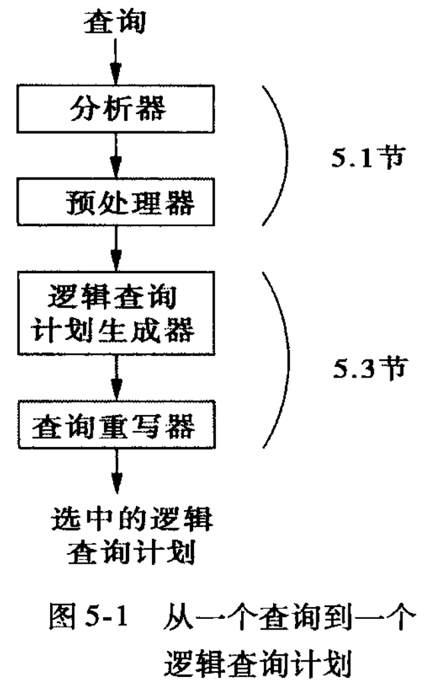

### 5.1.1 语法分析与语法分析树

语法分析树的结点应对应于两种之一：

1. 原子：属于语法成分，不可再分（如关键字 `SELECT` 等）。
2. 语法类：起相似作用的查询子成分（如所有查询都属于 `<Query>` 语法类，因此子查询也是 `<Query>` 语法类，此外还有 `<SelectList>` 和 `<Condition>` 语法类等）。

### 5.1.2 SQL的一个简单子集的语法

下面是同一个查询的两种形式及其语法树表示

```sql
-- 涉及的关系如下
StarsIn(movieTitle, movieYear, starName)
MovieStar(name, address, gender, birthdate)
```

- 查询至少有一名演员出生于1960年的电影的名字（形式1）

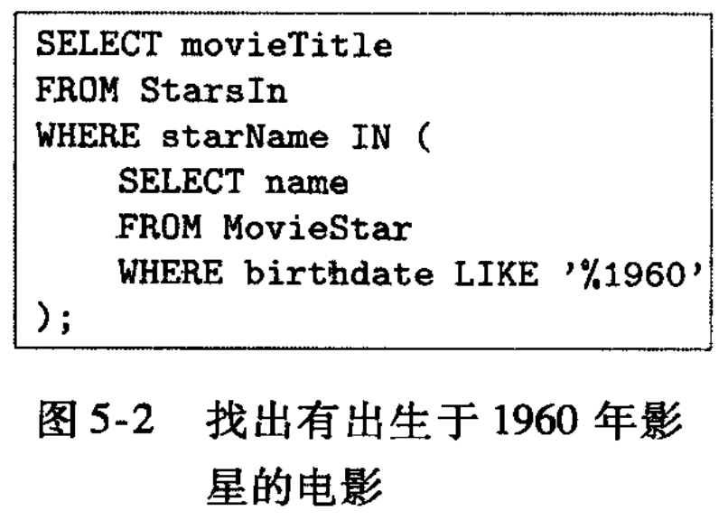

- 查询形式1的语法树形式

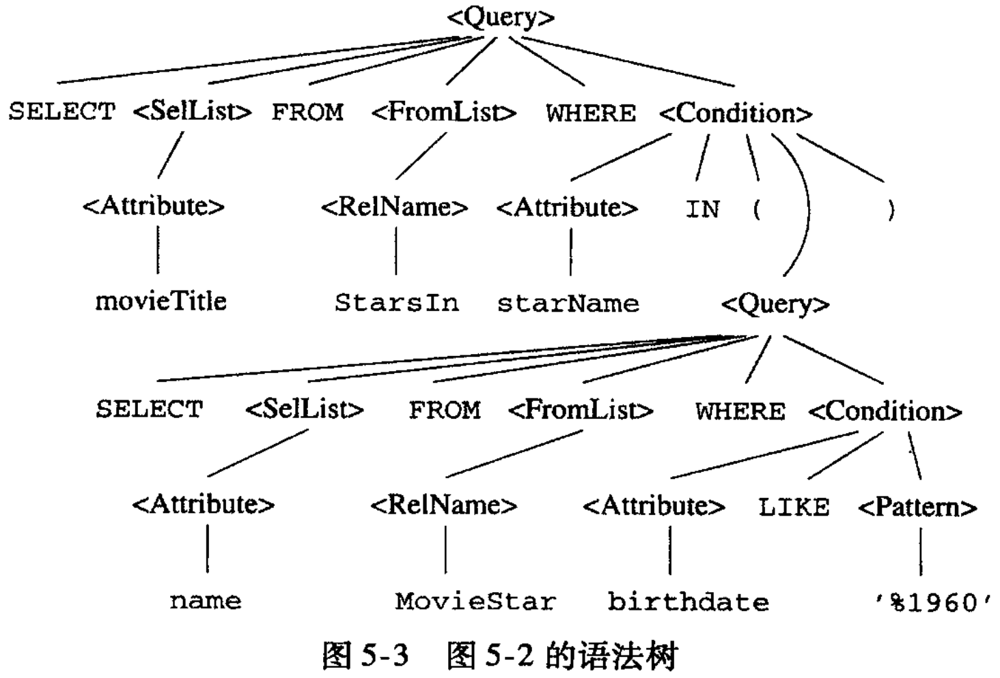

- 查询至少有一名演员出生于1960年的电影的名字（形式2）

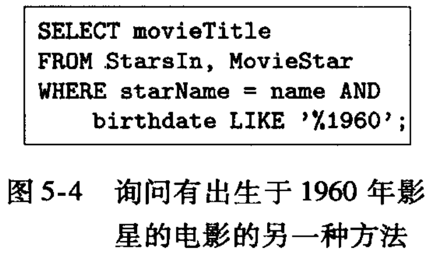

- 查询形式2的语法树形式

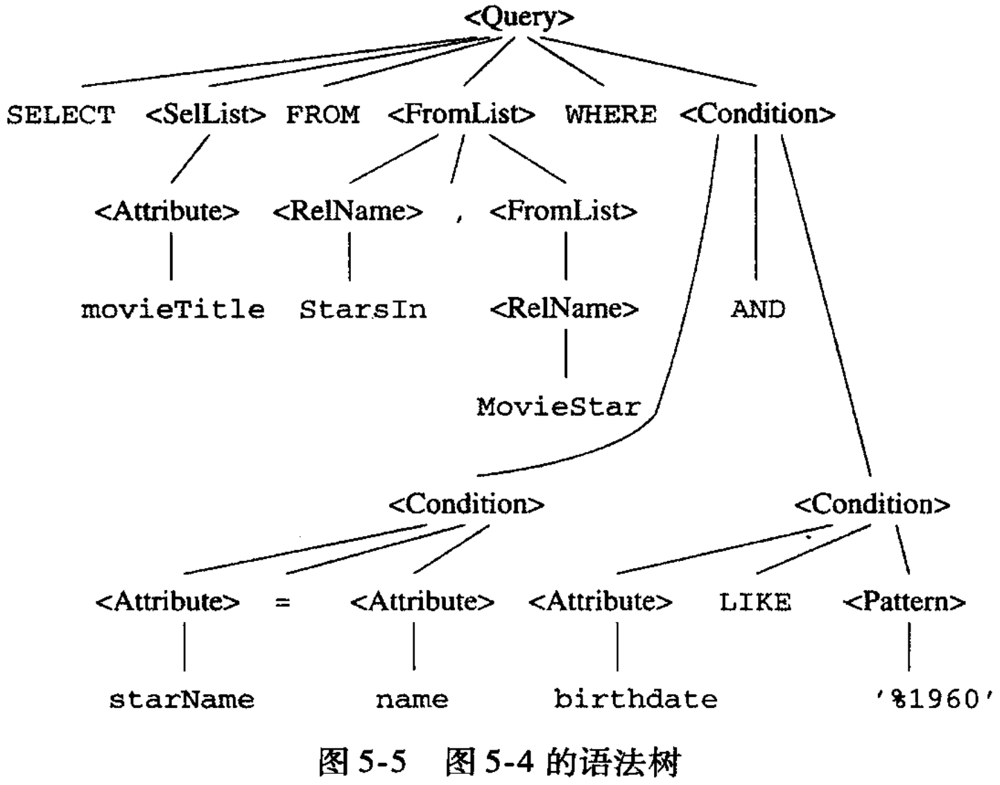

### 5.1.3 预处理器

预处理器有多种作用，其一是将查询的视图出现的位置以视图的定义的语法树来替换。

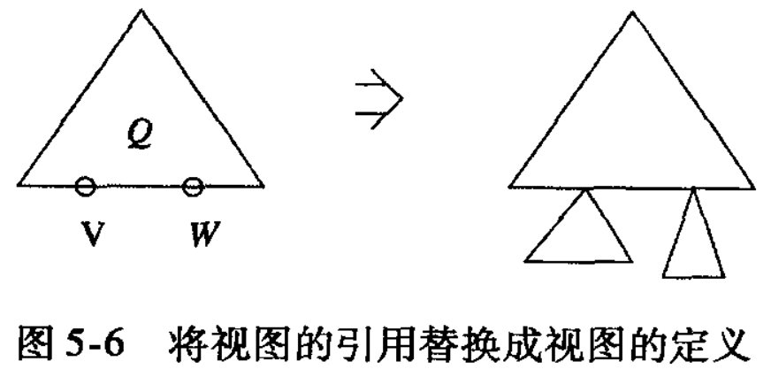

预处理器的另一个作用是语义检查，包括：

1. 检查关系的使用（关系需属于当前模式等）。
2. 检查与解析属性的使用（属性需属于当前查询中出现的关系等）。
3. 检查类型（属性等类型需适应于其使用的情况）。

### 5.1.4 预处理涉及视图的查询

创建视图的语句及其表达式树：

```sql
CREATE VIEW ParamountMovies AS
	 SELECT title, year
	   FROM Movies
	  WHERE studioName = 'Paramount'
```

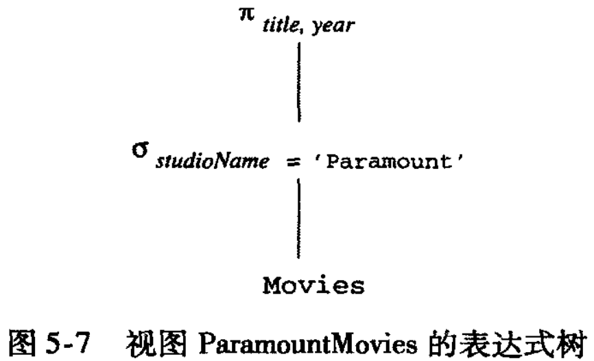

- 目标查询的语句及表达式树

```sql
SELECT title
  FROM ParamountMovies
 WHERE year = 1979
```

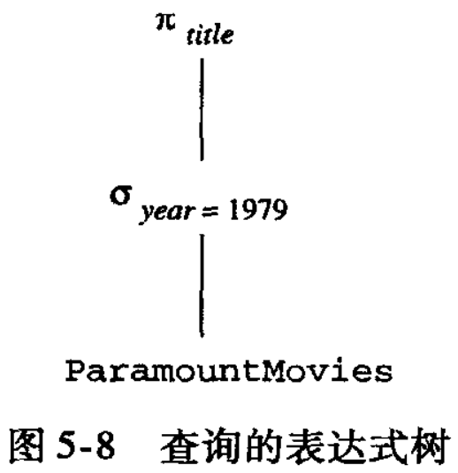

- 视图替换后的查询的表达式树

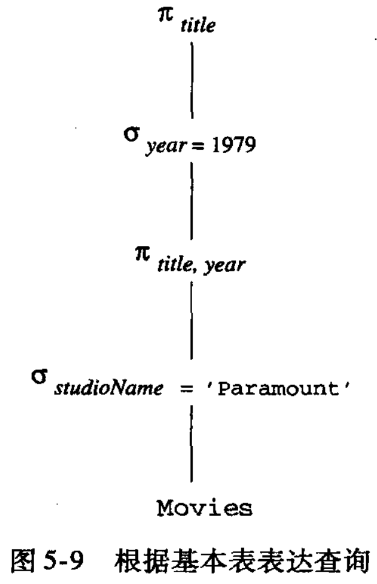

- 下推选择和投影并合并后的表达式树

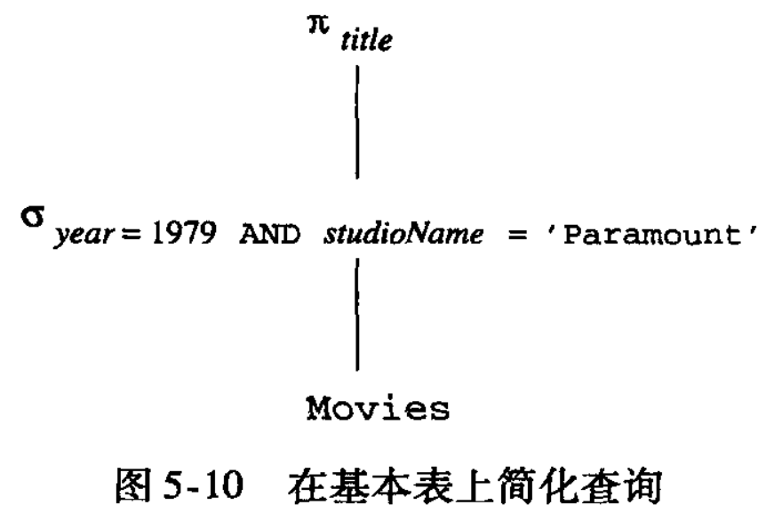

## 5.2 用于改进查询计划的代数定律

语法树要转换为逻辑计划前还需要转换为代数表达式树，这样才可以将代数定律应用在其上。

### 5.2.1 交换律与结合律（针对关系运算符）

当一个运算符同时满足交换律与结合律时，就可以对用这个运算符连接起来的任意多个操作数进行随意组合与排列而不改变结果。

关系代数的多个运算符同时满足结合律与交换律：

- **笛卡尔积：**
  - $R \times S = S \times R$
  - $(R \times S) \times T = R \times (S \times T)$
- **自然连接：**
  - $R \bowtie S = S \bowtie R$
  - $(R \bowtie S) \bowtie T = R \bowtie (S \bowtie T)$
- **并集：**
  - $R \cup S = S \cup R$
  - $(R \cup S) \cup T = R \cup (S \cup T)$
- **交集：**
  - $R \cap S = S \cap R$
  - $(R \cap S) \cap T = R \cap (S \cap T)$

$\theta$连接（即基于条件的连接）**满足交换律**：$R \bowtie_C S = S \bowtie_C R$。此外，若条件所在位置是有意义的，则条件（$\theta$）连接也满足结合律。总之条件连接的结合律不可随意使用。

### 5.2.2 涉及选择的定律

> 对于不同的关系运算符，选择的下推情况是不同的。

由于选择可以明显的减少关系的大小，因此进行有效查询处理最重要的规则之一就是只要不改变表达式的结果，就把选择在语法树上尽可能地下移。

尽管“选择下推”这个变换并不十分通用，但该思想仍是查询优化的一个主要手段。

将复杂条件分解为其组成部分这个规则的动机是部分条件涉及的属性比整个条件少，可以移动到某个方便的地方，而整个条件则不一定能够移入。这便是选择运算符（ $\sigma$ ）的分解定律：

- $\sigma_{C_1\,\text{AND}\,C_2}(R)=\sigma_{C_1}(\sigma_{C_2}(R))$
- $\sigma_{C_1\,\text{OR}\,C_2}(R) = (\sigma_{C_1}(R))\cup_S(\sigma_{C2}(R))$

第二条定律只有在R为集合时才成立，如果 R 为包，集合并不会正确地消除重复。

另一类选择的定律是将选择下推到二元运算符（积、并、交、差、连接）的参数中。根据 $\sigma$ 下推到哪个参数可以分为三类：

1. 对于并（ $\cup$ ），选择必须下推到两个参数中。
   - $\sigma_C(R \cup S) = \sigma_C(R) \cup \sigma_C(S)$
2. 对于差，选择必须下推到第一个参数中，下推到第二个参数是可选的（这很好理解，选择运算符是挑选出将要留在结果集中的元组，而差运算是先计算第一个操作数，将其结果作为待选择的结果集再作为第二个操作数的条件，如果第一个操作数的结果都不符合选择的条件，那么最终的结果集不可能出现符合选择条件的元组，因此选择必须要下推到第一个操作数中）。
   - $\sigma_C(R - S) = \sigma_C(R) - S$
   - $\sigma_C(R - S) = \sigma_C(R) - \sigma_C(S)$ （可选）
3. 对于其他运算符，只要求选择下推到其中一个参数。对于 $\sigma_C$ ，我们只能将其下推到一个包含条件中涉及的全部属性的关系中（若存在）。假设关系 R 具有条件中提及的全部属性，则：
   - $\sigma_C(R \times S) = \sigma_C(R) \times S$
   - $\sigma_C(R \bowtie S) = \sigma_C(R) \bowtie S$
   - $\sigma_C(R \bowtie_D S) = \sigma_C(R) \bowtie_D S$
   - $\sigma_C(R \cap S) = \sigma_C(R) \cap S$
   - 若条件只涉及 S 的属性，则有 $\sigma_C(R \times S) = R \times \sigma_C(S)$
   - 若 R 和 S 都恰好包含了条件中的属性，则有 $\sigma_C(R \bowtie S) = \sigma_C(R) \bowtie \sigma_C(S)$ ，注意对于积和连接来说不可能应用这个定律的变种，因为在这种情况下 R 与 S 没有公共的属性，但是交总能应用因为要求其模式必须相同。

### 5.2.3 下推选择

在表达式树中下推选择是查询优化器最强有力的工具。**然而，当查询包含虚视图时，有时首先将选择尽可能往树的上部移是很必要的，然后再把选择下推到所有可能的分支。**

> 从后面的例子来看，这种做法和视图定义中选择条件的属性也有关系。后面会看到，在这个例子里，由于条件里的属性在另一个关系中也存在，所以从视图里上移选择，再将选择同时下推到视图及另一个关系里才起到优化的作用。如果属性不包含在该关系里则在这个例子里这么做没用，但是优化方法作为一个通用的流程，应该照顾到所有的查询形式，因此应该也必须这么做。或许针对这种情况进行事先判断是否上移，不过这又涉及到了效率和成本及实现难度，不再讨论。

```sql
--# StarsIn(title, year, starName)
--# Movies(title, year, length, genre, studioName, producer)
CREATE VIEW MoviesOf1996 AS
     SELECT *
       FROM Movies
      WHERE year = 1996
```

- 查询“在1996年有哪些影星为哪些电影制作公司工作？“的SQL为：

```sql
SELECT starName, studioName
  FROM MoviesOf1996
       NATURAL JOIN
       StarsIn
```

视图 MoviesOf1996 的表达式为 $\sigma_{year=1996}(Movies)$ ，因此该查询是这个表达式与 StarsIn 的自然连接，然后再在两个属性上投影。查询整体的表达式如下：

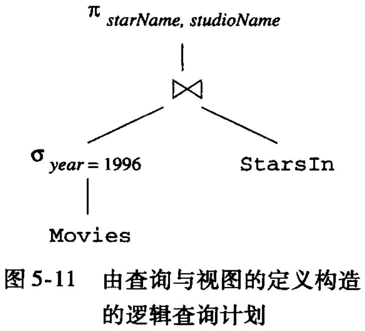

这是选择已位于它可移入的树的最下面了，因此已无法“在树中下推选择”了。然而，规则 $\sigma_C(R \bowtie S) = \sigma_C(R) \bowtie S$ 可以“反过来”用，把 $\sigma_{year=1996}$ 移动到连接上面。接着，由于 year 是连接两侧的公共属性，所以可以下推到连接两侧。这很可能改进了这个查询因为选择在连接之前减少了 StarsIn 的大小。

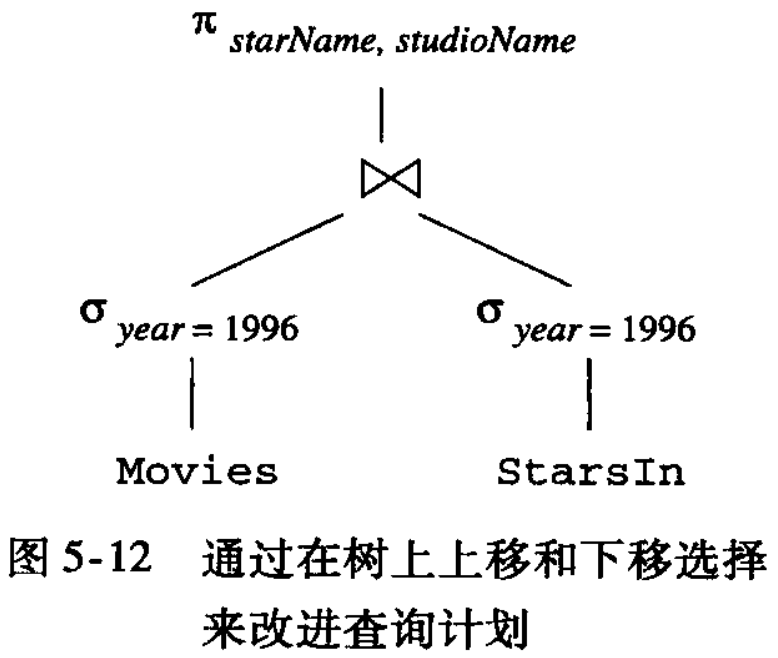

优化步骤如下：

1. **原始查询：** $\pi_{\text{starName},\text{studioName}}(\sigma_{\text{year}=1996}(\text{Movies})\bowtie\text{StarsIn})$
2. **上移查询：** $\pi_{\text{starName},\text{studioName}}(\sigma_{\text{year}=1996}(\text{Movies}\bowtie\text{StarsIn}))$
3. **下推选择：** $\pi_{\text{starName},\text{studioName}}(\sigma_{\text{year=1996}}(\text{Movies})\bowtie\sigma_{\text{year=1996}}(\text{StarsIn}))$

### 5.2.4 涉及投影的定律

投影同样可以下推到多个其他的运算符中。下推投影不像下推选择那么有用，原因是选择通常以较大的因子减少关系的大小，而投影不改变元组数，只减少元祖的长度。为描述使用扩展投影的转换，需要介绍一些术语：

考虑投影列表中的项 $E \rightarrow x$ ，其中 $E$ 是一个属性或含有属性与常量的一个表达式。那么， $E$ 中全部属性是投影的*输入*属性， $x$ 是投影的*输出*属性。若一个项是单个属性组成的，则它既是输入属性也是输出属性。若一个投影列表的属性构成不包含更名或非单个属性的表达式，则我们称该投影是*简单*的。

投影定律之后隐藏的原理是：

- 我们可以在表达式树的任何地方引入投影，只要它所消除的属性是其上的运算符从来不会用到的，并且也不在整个表达式的结果之中。

尽管一些引入的投影是不必要的：

- $\pi_L(R \bowtie S) = \pi_L(\pi_M(R) \bowtie \pi_N(S))$ ，其中 $M$ 和 $N$ 是连接属性，且分别包含在 $R$ 和 $S$ 中的 $L$ 的输入属性。
- $\pi_L(R \bowtie_C S) = \pi_L(\pi_M(R) \bowtie_C \pi_N(S))$ ，其中 $M$ 和 $N$ 是连接属性（如在 $C$ 中提到的属性），且分别包含在 $R$ 和 $S$ 中的 $L$ 的输入属性。
- $\pi_L(R \bowtie S) = \pi_L(\pi_M(R) \times \pi_N(S))$ ，其中 $M$ 和 $N$ 分别是包含在 $L$ 的输入属性中的 $R$ 和 $S$ 的全部属性。

我们可以在包并之前进行投影。即 $\pi_L(R \cup_B S) = \pi_L(R) \cup_B \pi_L(S)$ ，与此相反，投影不能被推到集合并或集合、包的交或差之下。

若投影涉及一些计算，且投影列表中的某一项的输入属性全部属于投影下面连接或积的其中的某一参数，则可以选择直接在那个参数上进行计算，尽管这不是必须的。

下推投影到选择之下也是可能的。即 $\pi_L(\sigma_C(R)) = \pi_L(\sigma_C(\pi_M(R)))$ ，其中 $M$ 是 $L$ 的输入属性列表或是条件 $C$ 中提到的属性列表。

### 5.2.5 有关连接与积的定律

1. $R \bowtie_C S = \sigma_C(R \times S)$
2. $R \bowtie S = \pi_L(\sigma_C(R \times S))$ ，条件 $C$ 的含义是 $R$ 和 $S$ 中具有相同名字的属性对进行等值比较， $L$ 是包含 $R$ 与 $S$ 中每个等值对中的一个属性以及其他所有属性的列表。

**在实际中，我们通常想从右到左使用这些规则。即希望把其后跟着选择的积转换为某个连接。这样做的原因是计算连接的算法通常比计算积之后跟着一个对该积的（很大的）结果的选择的算法要快得多。**

### 5.2.6 有关消除重复的定律

运算符 $\delta$ 用于从包中消除重复，它可下推到多个运算符中，但不是全部运算符。一般而言，将 $\delta$ 移到树的下边减少了中间关系的大小从而可能是有益的。此外，我们有时会把 $\delta$ 移到一个可以完全消除的位置，因为它作用于一个不含重复元组的关系上。

- 若 $R$ 没有重复，则 $\delta(R) = R$ 。这样的关系 $R$ 的几个重要情形包括：
  - 声明了主键的一个存储的关系。
  - 属于 $\gamma$ 运算结果的一个关系，因为分组创建一个没有重复的关系。
  - 集合的一个并、交、差运算的结果（集合的并、交、差运算结果仍是集合，因此不含重复元素）。

在其他运算符中“下推” $\delta$ 的几个定律如下：

- $\delta(R \times S) = \delta(R) \times \delta(S)$
- $\delta(R \bowtie S) = \delta(R) \bowtie \delta(S)$
- $\delta(R \bowtie_C S) = \delta(R) \bowtie_C \delta(S)$
- $\delta(\sigma_C(R) = \sigma_C(\delta(R)$

我们也可以把 $\delta$ 移到交运算的其中一个参数或两个参数上：

- $\delta(R \cap_B S) = \delta(R) \cap_B S = R \cap_B \delta(S) = \delta(R) \cap_B \delta(S)$

与此相反，一般而言 $\delta$ 不能移入 $\cup_B$ ， $-_B$ 、或 $\pi$ 等运算符中。

### 5.2.7 涉及分组与聚集的定律

考虑运算符 $\gamma$ 时，会发现很多变换的应用取决于所用聚集运算符的细节。因此，并不能像用于其他运算符定律那样陈述它的通用定律。其中一个例外是5.2.7节提到的定律，即 $\gamma$ 吸收 $\delta$ 。

- $\delta(\gamma_L(R)) = \gamma_L(R)$

另一个通用规则是：在应用 $\gamma$ 运算符之前，只要我们需要，可以用投影在参数中去除无用的属性。

- $\gamma_L(R) = \gamma_L(\pi_M(R))$ ，其中 $M$ 是至少包含 $L$ 中提到的所有的 $R$ 属性的列表。

其他变换依赖于 $\gamma$ 运算符之中的聚集之原因是某些聚集，尤其是 MIN 与 MAX ，不受重复是否存在的影响。而另一些聚集，如 SUM 、 COUNT 、 AVG ，如果在聚集之前消除重复，一般会得到不同的值。

因此，我们称运算符 $\gamma_L$ 是不受重复影响的，如果 $L$ 中仅有的聚集是 MIN 与/或 MAX 。则有：

- $\gamma_L(R) = \gamma_L(\delta(R))$ ，成立的条件是 $\gamma_L$ 是不受重复影响的。

查询“每一年中出现在一部该年电影中最年轻影星的生日”的查询如下。

```sql
-- 涉及的关系
--# MovieStar(name, addr, gender, birthdate)
--# StarsIn(movieTitle, movieYear, starName)
-- 查询语句
SELECT movieYear, MAX(birthdate)
  FROM MovieStar, StarsIn
 WHERE name = starName
 GROUP BY
       movieYear
```

查询语句直接构造的初步逻辑查询计划如图：

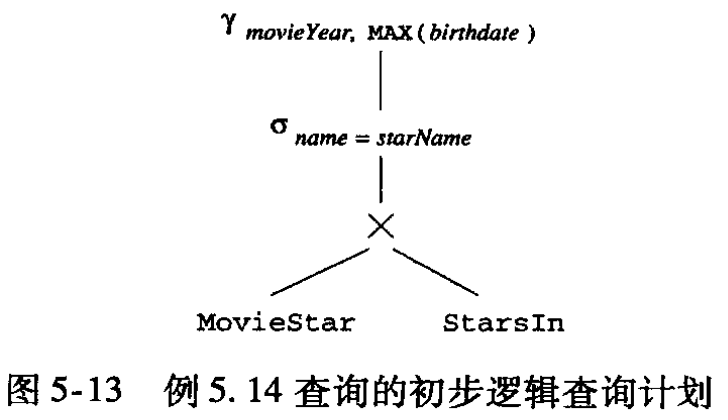

如果我们愿意的话，可以对其运用如下的变换：

1. 将选择与积组合成一个等值连接。
2. 在 $\gamma$ 之下引入 $\delta$ ，因为 $\gamma$ 是不受重复影响的。
3. 在 $\gamma$ 与所引入的 $\delta$ 之间引入 $\pi$ ，投影到 movieYear 与 birthdate 上，与 $\gamma$ 相关的仅有的两个属性。

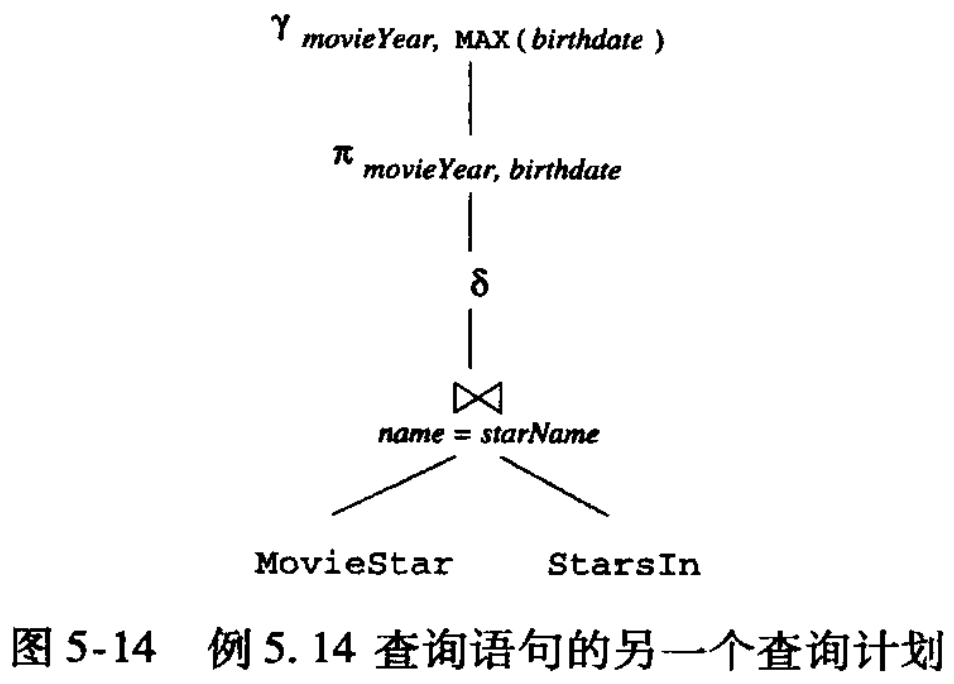

现在我们可以下推 $\delta$ 到 $\bowtie$ 之下，并且如果需要的话可在 $\delta$ 之下引入 $\pi$ 。并且如果 name 是 MovieStar 的键，延伸到这个关系的分枝上的 $\delta$ 可以去除。

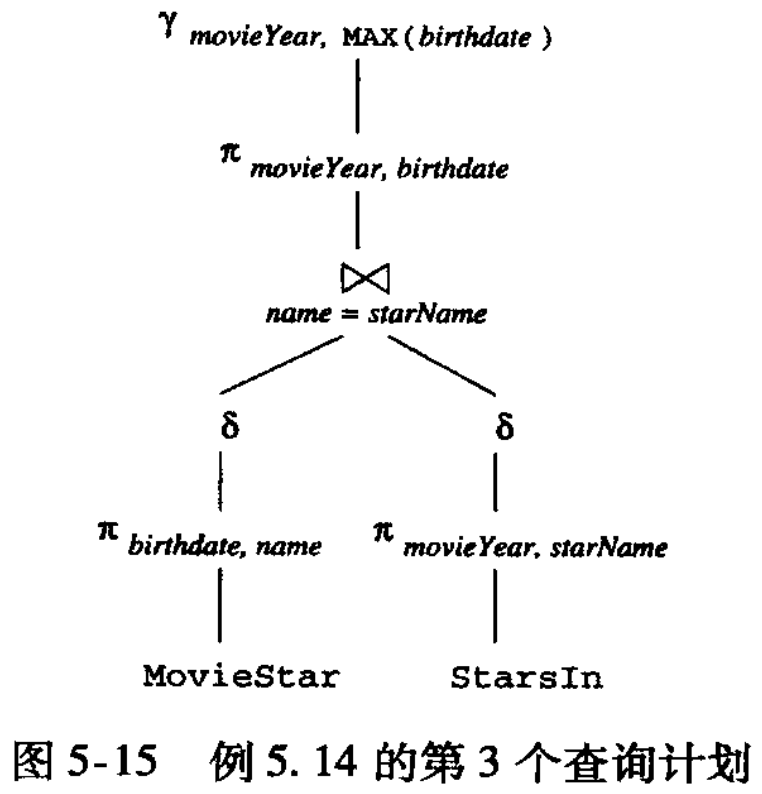

## 5.3 从语法分析树到逻辑查询计划

在5.1节中介绍了构造一个查询语句的语法分析树，接着需要将语法分析树转换为逻辑查询计划。

第一步，按适当的群组用一个或多个关系代数运算符替换语法书上的节点与结构。第二步，利用第一步中产生的关系代数表达式将其转换成我们所期望的一个表达式，它可被转换成最有效的物理查询计划。

### 5.3.1 转换成关系代数

非正式地说明将 SQL 语法树转换成代数的逻辑查询计划的一些规则。第一条规则也可能是最重要的，能够直接将所有的“简单的” select-from-where 结构转换成关系代数。非正式地陈述为：

- 如果有一个包含 `<Condition>` 的没有子查询的 `<Query>` ，则可以用一个关系代数表达式来替换整个成分——选择列表、  from 列表以及条件，其中代数表达式**自底向上**由以下内容组成：
  - `<FromList>` 中提及的全部关系的积是以下运算符的参数。
  - 选择 $\sigma_C$ ，其中 $C$ 就是要被替换成分中的 `<Condition>` 表达式，同时选择优势下面运算符的参数。
  - 投影 $\pi_L$ ，其中 $L$ 是 `<SelectList>` 中的属性列表。

对图5.5使用上述规则，得到的表达式树如下：

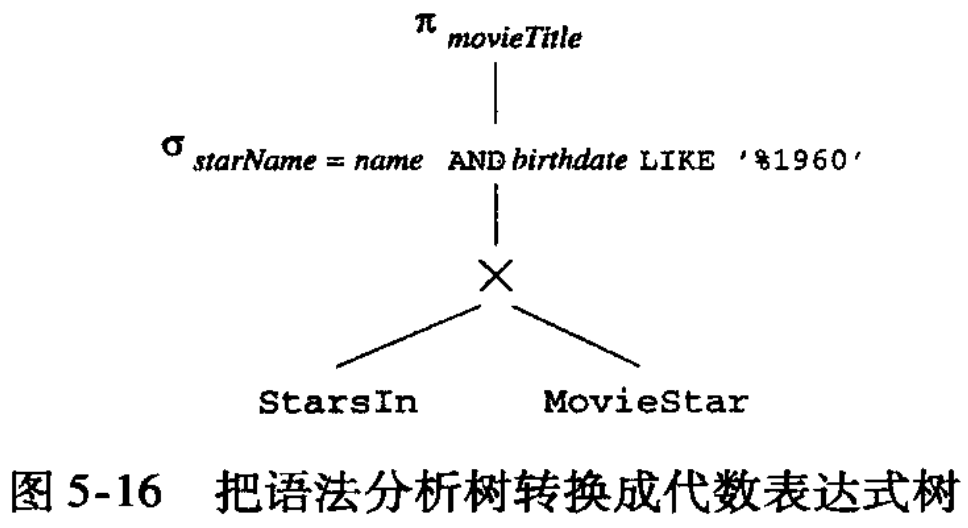

同样的变换不能应用到图 5-3 所示的外层查询上，原因是条件中包含一个子查询。然而可以将规则运用到子查询上，得到的关系代数表达式是 $\pi_{name}(\sigma_{birthdate\,\text{LIKE'\%1960'}}(\text{MoiveStar}))$

### 5.3.2 从条件中去除子查询

对于 `<Condition>` 中包含子查询的（整个）语法树，需要引入一种介于语法树的语法类与作用到关系上的关系代数运算符之间的中间形式——*两参数选择*。两参数选择将使用不带参数的标签为 $\sigma$ 的节点表示经转换后的语法树中的两参数选择。该节点之下有一个左子节点，它表示要对其做选择运算的关系 $R$ ，以及一个右子节点，它表示作用到关系 $R$ 的每个元组上的条件表达式。两个参数均可表示为语法树、表达式树或者两者的混合。

如下是对图 5-3 中的语法树使用两参数选择的重写。其中进行了多种变换：

1. 图5-3中的子查询被一个关系代数表达式所替代（就是前一节最后提过的表达式 $\pi_{name}(\sigma_{birthdate\,\text{LIKE'\%1960'}}(\text{MoiveStar}))$ )。
2. 外层查询用上一节的 select-from-where 表达式规则也已经进行了替换。不过我们已经将必须的选择表示为两参数选择，而不是常规的关系代数运算符 $\sigma$ 。因此，标有 `<Condition>` 的语法树的上层节点没有被替换，而是仍旧作为选择的一个参数，其圆括号和 `<Query>` 按第 1 点被关系代数表达式替换。

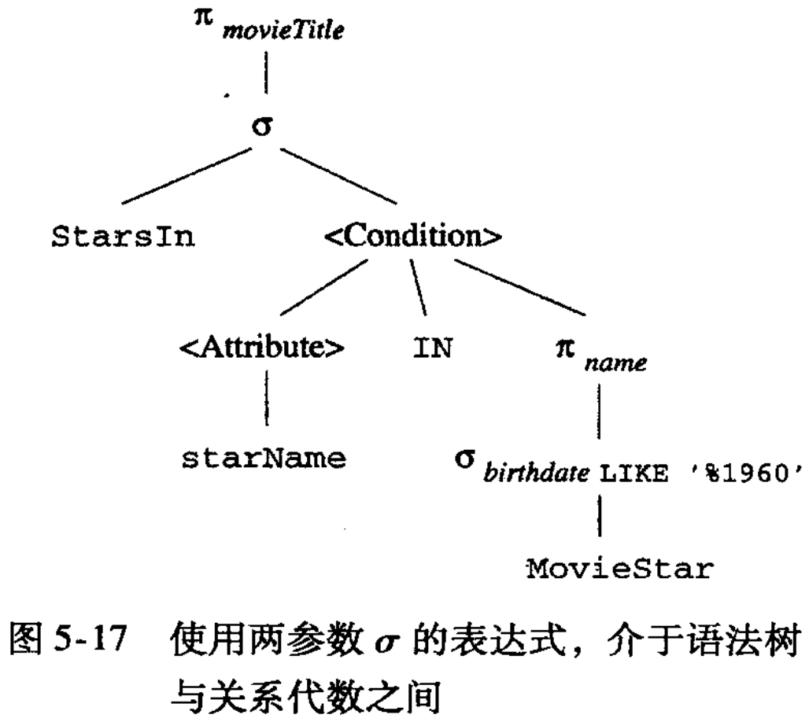

此树需进一步转换。需要一种规则来用单参数选择与其他关系代数运算符来替换两参数选择。**每种形式的条件可能需要其自身的规则。**有时可以消除两参数选择而转换为纯关系代数表达式，但在一些极端条件下，两参数选择只能被保留且认为是逻辑查询计划的一部分。

消除图 5-17 中的带 $IN$ 运算条件的两参数选择（注意，且 `<Condition>` 条件中的子查询是不相关的，即子查询的关系可以只计算一次，与要被检测的元组无关）的规则非正式地陈述如下：

- 假设有一个两参数选择，其中第一个参数代表某个关系 $R$ ，第二个参数是一个形如 $t\,\text{IN}\,S$ 的 `<Condition>` ，其中 $S$ 是一个非相关的子查询， $t$ 是 $R$ 的（某些）属性组成的一个元组。变换的规则如下：
  - 用 $S$ 的表达式的树替换 `<Condition>` 。如果 $S$ 有重复，则在 $S$ 的表达式的根部有必要包含一个 $\delta$ 运算，因此所形成的表达式所产生的元组不会多于原始查询所产生的元祖数。
  - 用一个单参数选择 $\sigma_C$ 替换两参数选择，其中 $C$ 是元组 $t$ 的每个分量与关系 $S$ 中相应的属性取等值的条件。
  - 给 $\sigma_C$ 一个参数，它是 $R$ 与 $S$ 的积。

转换如下图所示：

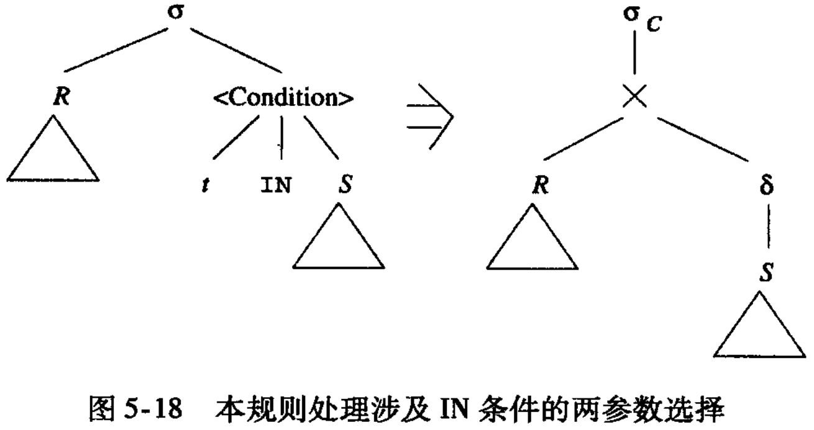

将规则用于图 5-17 中的两参数选择，我们会得到下图所示的代数表达式。其中由于 name 是 MovieStar 的键，因此消除重复操作不需要了，此外转换后的单参数选择和其参数（积）也可合并为连接。

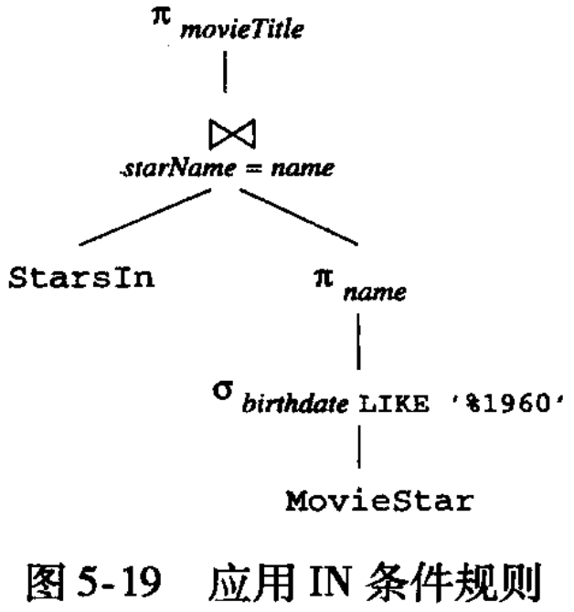

当子查询相关时，将子查询翻译成关系代数的策略更为复杂。<u>由于相关子查询涉及在其之外定义的未知值，它们不能进行孤立的翻译。</u>**确切地，我们需要对子查询进行翻译。使得它能产生一个出现了某些特定的额外属性的关系，这些属性在以后将于外部定义的属性相比较。**然后把子查询到外部属性的相关属性的条件应用到这个关系上，不再需要的额外属性可以投影消除。在此过程中，如果该查询在最后没有消除重复，我们必须避免引入重复元组。

查询“找出那些在制作时影星平均年龄至多为 40 岁的电影”的 SQL 如下：

```sql
-- 涉及的关系
--# MovieStar(name, addr, gender, birthdate)
--# StarsIn(movieTitle, movieYear, starName)
-- 为了方便，将 birthdate 视作年份
SELECT DISTINCT m1.movieTitle, m1.movieYear
  FROM StarsIn m1
 WHERE m1.movieYear - 40 <= (
           SELECT AVG(birthdate)
             FROM StarsIn m2, MovieStar s
            WHERE m2.starName = s.name AND
                  m1.movieTitle = m2.movieTitle AND 
                  m1.movieYear = m2.movieYear
       )
```

下图展示了初步转换为表达式树的结果：

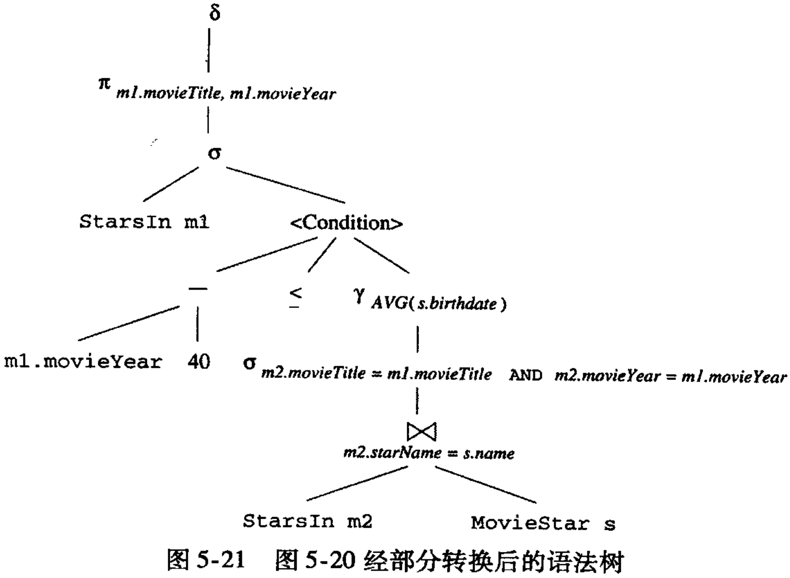

> ==注意图 5-21 ，这里的 $\gamma$ 操作符指的是聚合操作，详细情况参考《数据库系统基础教程》的分组操作符章节。==

为了移除 `<Condition>` 节点并消除两参数选择，必须创建一种用于描述 `<Condition>` 右分支上关系的表达式。然而，由于子查询是相关的，无法从子查询所涉及的关系 `StarsIn` （别名是 `m2` ）与 `MovieStar` 中获取属性 `m1.movieTitle` 或 `m1.movieYear` 。因此需要延迟选择 $\sigma_{m2.movieTitle\,=\,m1.movieTitle\,\text{AND}\,m2.movieYear\,=\,m1.movieYear}$ 直到子查询中的关系与外层查询中 `StarsIn` 的拷贝（其别名为 `m1` 的拷贝）相结合之后。为按这种方式（指延迟选择）转换逻辑查询计划，我们需要修改 $\gamma$ 按属性 `m2.movieTitle` 和 `m2.movieYear` 进行分组（原来只是聚集操作，现在变成分组加聚集），所以当需要这些属性进行选择时，它们便可获得。最后的效果是我们为子查询计算一个由电影组成的关系，其每个元组由 `title` 、 `year` 以及该电影的平均影星出生年份组成。

> 子查询中的 m1 相关参数即是前面描述的“子查询外定义的未知值”。两个关系都是集合，分组操作符和去重是等价的。

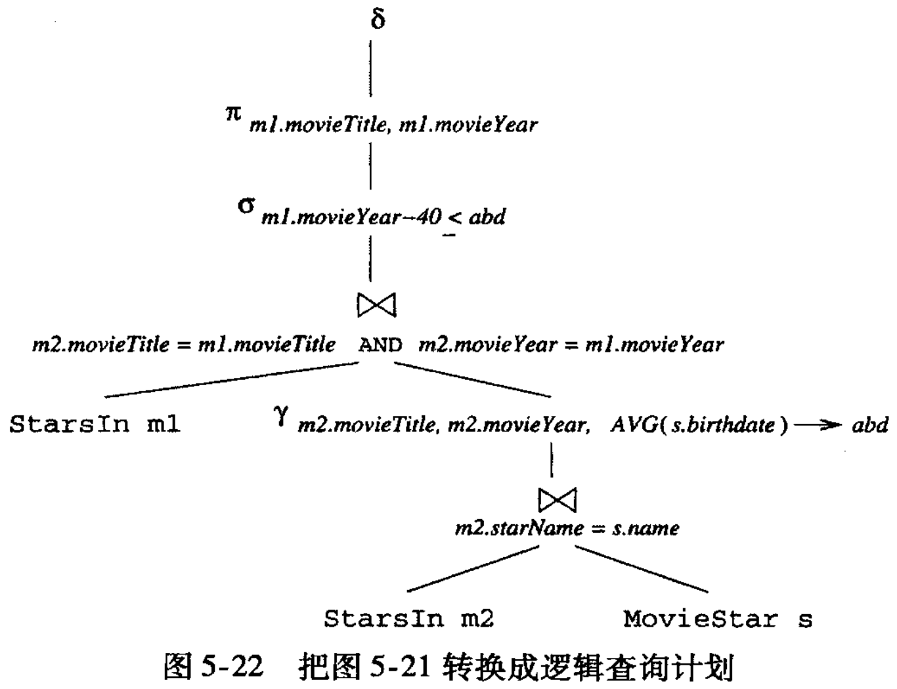

修改后的 $\gamma$ 运算符如上图表示的。除两个分组属性外，还需要把平均出生日期更名为 abd(average birthdate) ，方便后续引用。

在接下来的章节中会看到查询优化器改进查询计划还能做很多事。比如这个例子由于满足三个条件，使得它可以被进一步优化：

1. 重复是最后消除的。
2. `StarsIn m1` 中的影星名字被投影掉了。
3. `StarsIn m1` 与表达式的其余部分之间的连接将 `StarsIn m1` 中的 `title` 、 `year` 属性与 `StarsIn m2` 中的属性取等值。

由于这些条件的成立，可以分别用 `m2.movieTitle` 与 `m2.movieYear` 替换 `m1.movieTitle` 与 `m1.movieYear` 。因此，上部的连接是不必要的，参数 `StarsIn m1` 亦是如此。改进后的逻辑查询计划如图：

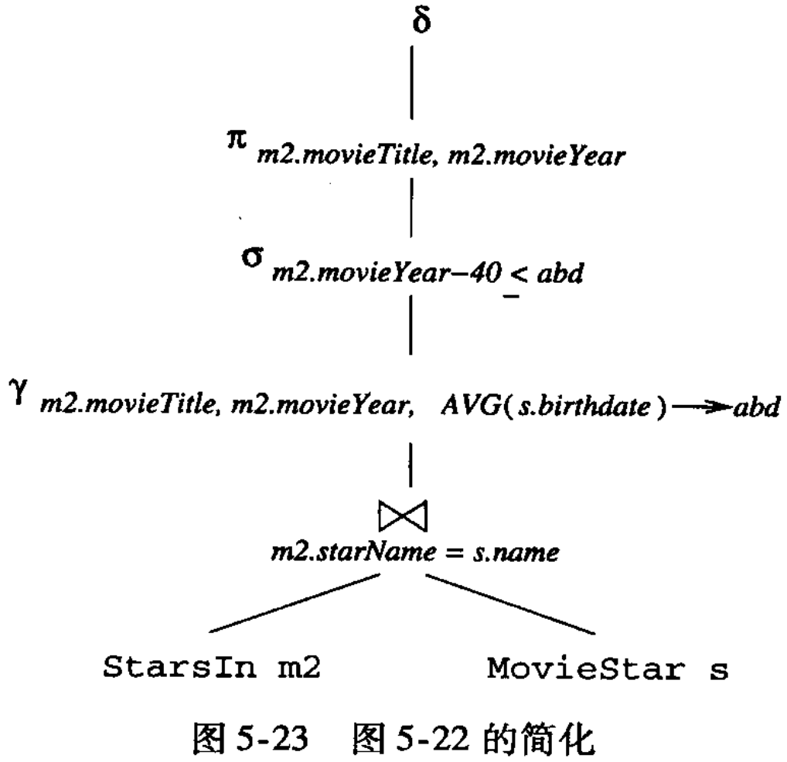

### 5.3.3 逻辑查询计划的改进

当把 SQL 转为关系代数时就获得了一个可能的逻辑查询计划。下一步使用在 5.2 节中列出的代数定律重写计划。另外，可能产生多个逻辑计划，表示不同的运算符顺序或组合。但是查询重写模块会选取它认为“最佳”的单个逻辑查询计划，其含义是该计划很可能最终得到最便宜的物理计划。

5.2 节有许多代数定律有望改进逻辑计划。下列定律是优化器中最常用到的：

- 选择（ $\sigma$ ）可尽可能深地推入表达式树中。若选择是多个条件的 AND ，则可以把该条件分解并分别将每个条件下推（但记住，在 5.2.3 节提到过有时首先将选择上推是必要的）。
- 投影（ $\pi$ ）可被下推到树中，或新的投影可被加入（有选择时下推投影应当小心，参考 5.2.4 节）。
- 重复消除（ $\delta$ ）有时可以去掉，或移到树中更方便的位置（参考 5.2.6 节）。
- 有些选择可以与其下面的积相结合以便把运算对转换成等值连接。

### 5.3.4 可结合/可分配的运算符的分组

满足结合律与交换律的运算符可视为具有任意多个操作对象。诸如将连接的运算符看作多路运算符使得可重新对操作对象排序，这样当连接作为一个二元连接序列执行时，它们所花时间将比按语法树所隐含的连接顺序的执行时间少。

在产生最终的逻辑计划之前进行最后一步：对于子树的有相同的可结合和可分配的运算符结点所组成的每一个部分，将这些运算符的结点组成单个具有多子女的节点。常用的满足结合律与分配律的运算符是自然连接、并与交。在特定情形下，自然连接与 $\theta$ 连接可以相互结合：

1. 必须用 $\theta$ 连接替换自然连接，将具有相同名字的属性取等值。
2. 必须增加一个投影以便消除已变为 $\theta$ 连接的自然连接中涉及的重复属性。
3. 连接的条件必须是可结合的（在 5.2.1 节讨论过存在 $\theta$ 连接不满足结合律的情形）。

此外，积被认为是自然连接的特例，并且，若在树中与连接相邻则与连接相结合。下面是一个例子：

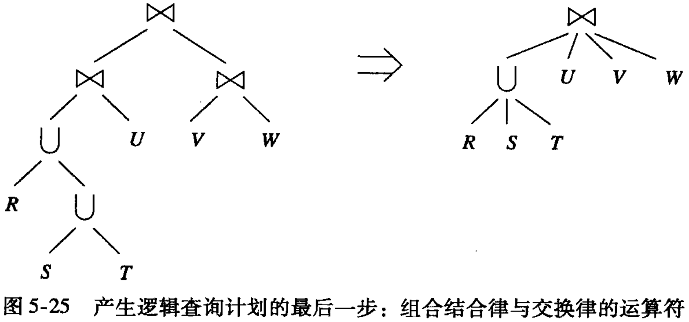

## 5.4 运算代价的估计

对于已经进行了语法分析并转换为逻辑计划的查询，下一步动作就是使用*基于代价的枚举*将逻辑计划转换为物理计划。对由给定逻辑计划导出的可能的物理计划进行枚举时，会为每个物理计划做出以下选择：

1. 满足结合律与分配律的运算，如连接、并、交的次序与分组。
2. 在逻辑计划中每个运算符的算法，例如，决定使用嵌套循环连接或散列连接。
3. 其他运算符，如扫描、排序等，它们是物理计划所需的但在逻辑计划中都不显式地存在。
4. 参数从一个运算符传送到下一个运算符的方式，例如，通过在磁盘上保存的中间结果或者通过使用迭代算子并每次传送一个参数的一个元组或一个主存缓冲区。

在讨论物理计划枚举前，必须先考虑如何准确估计计划的代价。这种估计是基于数据的参数来做的，这些参数要么精确的由数据计算而得，要么是由“统计量收集”过程来估计。在给定这些参数的情况下，就可对关系大小进行许多合理的估计，它们可用于估计完整物理计划的代价。

> 用来表示关系大小的惯用记法：
>
> - $B(R)$ 是容纳关系 $R$ 所有元组所需的块数。
> - $T(R)$ 是关系 $R$ 的元组数。
> - $V(R,\,a)$ 是关系 $R$ 的属性 $a$ 的值计数，即关系 $R$ 中属性 $a$ 上所具有的不同值的数目（也称为 Cardinality ）。并且， $V(R,\,[a_1,\,a_2,\,...,\,a_n])$ 表示关系 $R$ 中属性 $a_1$ ，$...$ ， $a_n$ 作为整体考虑时所出现的不同值的数目，即 $\pi_{a_1,a_2,...,a_n}(R)$ 中的不同元组数。

### 5.4.1 中间关系大小的估计

对物理计划做出选择的目的是最小化执行查询的估计代价。理想的情况是可以得到估计中间关系中元组数的规则，使得这些规则：

1. 给出准确的估计。
2. 易于计算。
3. 逻辑上一致，即一个中间关系大小的估计不依赖于该关系的计算方式。例如，多个关系连接的大小估计不应当依赖于计算这些关系连接的次序。

同时满足三个条件是不可能的。但是所幸，大小估计的目标不是准确估计大小，而是帮助选择一个物理查询计划。即便是一个不准确的大小估计方法也可很好地达到这个目的，只要该方法产生的误差是稳定的，也就是说，若大小估计方法赋予最佳物理计划最小的代价，即使该计划的实际代价与所估计的代价不同。

### 5.4.2 投影运算大小的估计

扩展投影是包投影而且不去除重复。可将一个传统的去除重复的投影当做一个跟着 $\delta$ 运算符的包投影。包的扩展投影不同于其他运算符，因为结果的大小是可精确计算的。

投影运算可能会增大元组也可能减小元组，这很好理解。对于关系 $R(a,\,b,\,c)$ 我们投影的形式是任意的，这个新元组相比原关系，可能多出属性也可能少属性。

### 5.4.3 选择运算大小的估计

当执行选择时，一般而言是减少元组的数目，尽管元组的大小保持原样。最简单的选择情形即一个属性等于某个常量，有一个比较容易的方法估计结果的大小，前提是已经知道或可估计属性不同取值的数目。令 $S = \sigma_{A=c}(R)$ ，其中 $A$ 是 $R$ 的属性， $c$ 是一个常量。则推荐如下的一个估计：

- $T(S) = T(R) / V(R,\,A)$

当 $A$ 的值是从可选值中随机选的，以上规则必然成立。

当选择涉及非等值比较时，大小估计更困难，如 $S = \sigma_{a<10}(R)$ 。有人可能会认为平均而言有一半元组比较条件而另一半不满足，因此 $T(R)/2$ 是 $S$ 大小的估计。然而，直觉上涉及非等值比较的查询倾向于产生更小量的可能的元组。因此推荐的也是倾向于此的规则，并假设典型的不等值比较将返回约三分之一的元组而不是一半元组。因此推荐的估计是：

- $T(S) = T(R) / 3$

“不等”比较的情形是比较少的。但是如果遇到了 $S= \sigma_{a \neq 10}(R)$ 这样的选择，建议的估计是 $T(S) = T(R)$ ，即“不过滤”或者“全选择”。此外也可用 $T(S) = T(R) \times (V(R,\,a) - 1)/V(R,\,a)$ 作为其估计，由于承认约有 $1 / V(R,\,a)$ 个 $R$ 元组不满足条件，因为它们的 $a$ 值确实等于该常量，它比前一估计略小。

当选择条件 $C$ 是多个等值与不等值比较的 AND 时，可把选择 $\sigma_C(R)$ 作为多个简单选择的级联，其中的每一个选择只检查其中的一个条件。注意，选择之间的次序没有任何关系。其效果是结果的大小估计是**原始关系的大小乘以每个条件的选中率因子 (selectivity factor)** 。该因子对任何不等值比较是 1/3 ，对于 $\neq$ 是 1 ，对于条件 $C$ 中与一个常量相比较的任何属性 $A$ 取 $1/V(R,\,A)$ 。

有趣的是当条件矛盾时，分析将失效。例如 $S = \sigma_{a=10\,\text{AND}\,a>10}(R)$ 这个例子，显然 $T(S) = 0$ ，但是利用我们的规则就会得出错误答案。当重写逻辑计划时，查询优化器可查找许多特殊情形规则的实例。在这个例子里，优化器可应用那些用于查找逻辑上等价于 FALSE 选择条件的规则，并用空集代替 $S$ 表达式。

当选择涉及 OR 条件时，比如 $S = \sigma_{C_1\,\text{OR}\,C_2}(R)$ ，则结果的大小更难确定。一个简单假设是没有同时满足这两个条件的元组，因此结果的大小是分别满足各条件的元组之和。该度量一般是过高估计，并有时会得出荒谬结论： $S$ 中的元组数比原始关系中还多。

一个稍复杂但可能更准确的估计是假设 $C_1$ 和 $C_2$ 相互独立。即若 $R$ 有 $n$ 个元组，其中有 $m1$ 个满足 $C_1$ ，有 $m2$ 个满足 $C_2$ ，估计 $S$ 中元组的数目为： $n \times (1 - (1 - m_1/n)(1 - m_2/n))$ 。这个规则也很好理解： $1 - m_1/n$ 是不满足 $C_1$ 的那部分元组， $1 - m_2/n$ 是不满足 $C_2$ 的那部分元组。这两部分的积是不在 $S$ 中的那部分 $R$ 的元组， 1 减去这个积就是那部分属于 $S$ 的元组。

例：假设 $R(a,b)$ 有 $T(R) = 10,000$ 个元组，且 $S = \sigma_{a=10\,\text{OR}\,b<20}(R)$ ，令 $V(R,a)=50$ ，则满足 $a=10$ 的元组数的估计为 $T(R)/V(R,a)$ ，也就是 200 。满足 $b<20$ 的元组数估计为 $T(R)/3$ ，也就是 3333 。对 $S$ 大小的最简单的估计是取二数之和 (3533) 。基于条件是相互独立的假设的更为复杂的估计是： $10,000 \times (1-(1-200/10,000)(1-3333/10,000))$ （结果是 3466）。在本例中两个估计之间没有多少差别，从而对两种估计的选择不可能改变对最佳物理计划的估计。

可能出现在选择条件中的最后一个运算符是 NOT 。满足条件 $\text{NOT}\,C$ 的 $R$ 的元组的估计数是 $T(R)$ 减去满足 $C$ 的元组估计数。

### 5.4.4 连接运算大小的估计

只介绍自然连接。其他连接按以下纲要进行处理：

1. 等值连接中的元组数在考虑到变量名的变化后可按自然连接那样计算。
2. 其他 $\theta$ 连接可看成积之后跟一个选择来进行估计。积中的元组数是所涉及关系的元组数之积。

先假定两个关系的自然连接只涉及两个属性的等值比较。即研究连接 $R(X,Y) \bowtie S(Y,Z)$ ，但初步假定 $Y$ 是单个属性， $X$ 、 $Z$ 可代表任何属性集。即，是不能确定两个关系中 $Y$ 属性的值是如何联系的，但可以针对最通用的情形做简化的假设：

- ***值集的包含***。若 $Y$ 是出现在多个关系中的一个属性，则每个关系从值 $y_1,\,y_2,\,\dotsm$ 的一个固定列表的前头选择其值并且取尽前面的所有值。因此，若 $R$ 与 $S$ 是具有属性 $Y$ 的两个关系，且 $V(R,Y) \le V(S,Y)$ ，则 $R$ 的每个 $Y$ 值是 $S$ 的一个 $Y$ 值。
- ***值集的保持***。如果把 $R$ 与另一个关系连接，则不是连接属性的属性 $A$ （两个关系中不同时拥有）不会在其可能的值集中丢失值。更准确地说，若 $A$ 是 $R$ 的一个属性但不是 $S$ 的属性，则 $V(R \bowtie S,A)=V(R,A)$ 。

在这两个假设下，可以对 $R(X,Y) \bowtie S(Y,Z)$ 的大小做如下估计。设 $r$ 是 $R$ 的一个元组， $s$ 是 $S$ 的一个元组。应该如何计算 $r$ 和 $s$ 在属性 $Y$ 上相等的概率？假定 $V(R,Y) \ge V(S,Y)$ 。根据值集的包含假设，则 $s$ 的 $Y$ 的值肯定出现在 $R$ 的 $Y$ 的值当中。因此 $r$ 有和 $s$ 相同的 $Y$ 值的概率为 $1/V(R,Y)$ 。类似地，若 $V(R,Y) \lt V(S,Y)$ ，那么 $r$ 的 $Y$ 值将会出现在 $S$ 中，并且有 $1/V(S,Y)$ 的概率 $r$ 和 $s$ 有相同的值。一般而言，将在 $Y$ 上相等的概率当作 $1/\max(V(R,Y),V(S,Y))$ ，因此：

- $T(R \bowtie S) = T(R)T(S)/\max(V(R,Y),V(S,Y))$

### 5.4.5 多连接属性的自然连接

当连接 $R(X,Y) \bowtie S(Y,Z)$ 中的属性集 $Y$ 包含多于一个属性时，用一个 $Y$ 属性进行连接时的参数被用到 $Y$ 的每个属性上，即

- $R \bowtie S$ 的大小估计是通过 $T(R)$ 乘以 $T(S)$ ，对于每一个 $R$ 与 $S$ 的公共属性 $y$ ，除以 $V(R,y)$ 与 $V(S,y)$ 中较大者来计算。

### 5.4.6 多个关系的连接

最后，再来考虑自然连接的一般情形：$S = R_1 \bowtie R_2 \bowtie \dotsm \bowtie R_n$ 。假设属性 $A$ 出现在 $k$ 个 $R_i$ 中，在这 $k$ 个关系中值的集合的个数（即 $V(R_i,A)$ 的各个值，其中 $i = 1,2,\dotsm,k$ ）是 $v_1 \le v_2 \le \dotsm \le v_k$ ，次序从最小到最大。假设从每个关系中选一个元组。所选元组在属性 $A$ 上 相同的概率如何计算？考虑从具有最小数目的 $A$ 的值 $v_1$ 的关系中选取的元组 $t_1$ 。根据值集包含的假设，这 $v_1$ 个值中的每一个值在其他具有属性 $A$ 的关系中所发现的 $A$ 值中。考虑属性值 $A$ 上有 $v_i$ 个值的关系。它所选的元组 $t_i$ 在属性 $A$ 上与 $t_1$ 相同的概率为 $1/v_i$ 。由于此结论对所有 $i = 2,3,\dotsm,k$ 均为真，则所有 $k$ 个元组在 $A$ 上相同的概率是积 $1/v_2 v_3\dotsm v_k$ 。这个分析为估计任何连接的大小给出了一条规则。

- 从每个关系中元组数的积出发，然后，对于至少出现两次的属性 $A$ ，除以除了 $V(R,A)$ 中最小值之外的所有值。

类似地，我们可以对连接后的属性 $A$ 的值的数目进行估计。根据值集保持假设，该值就是这些 $V(R,A)$ 中最小的一个。

基于两个假设，还可以得到上面的估计规则的一个方便的特性：

- 不管如何对几个关系的自然连接中各项进行组合与排序，分别对每个连接应用估计规则所得到的结果大小是相通的。此外，这个估计与对几个关系作为一个整体来连接并且应用估计规则所得到的结果大小估计是相同的。

### 5.4.7 其他运算大小的估计

对于其余的运算，结果大小不易估计。

**并**：若采用包的并，则其大小正好是参数大小之和。集合的并可以大到两参数大小之和，也可小到两参数中较大者。建议取其中间值，例如，取较大者加上较小者的一半。

**交**：结果可以小到 0 个元组或多到两个参数的较小者，无论采用集合的交还是包的交。方法之一是取两极端的平均值，即，取较小者的一半。

**差**：当计算 $R - S$ 是，结果中可具有 $T(R)$ 至 $T(R)-T(S)$ 个元组。建议取平均值，即 $T(R)-T(S)/2$

**消除重复**：若 $R(a_1,a_2,\dotsm,a_n)$ 是一关系，则 $V(R,[a_1,a_2,\dotsm,a_n])$ 的大小为 $\delta(R)$ 。然而该值通常得不到，因此必须取近似值。在极端情况下， $\delta(R)$ 的大小可与 $R$ 的大小相同（无重复元组）或为 1 （全部元组相同）。 $\delta(R)$ 中元组数的另一个上限是可能存在的不同元组的最大数：$V(R,a_i)$ 之积， $i=1,2,\dotsm,n$ 。该数可能比 $T(\delta (R))$ 的其他估计更小。有许多规则可用于估计 $T(\delta(R))$ （这里并未介绍）。一个合理的估计是取 $T(R)/2$ 与所有 $V(R,a_i)$ 之积中较小的一个。

**分组与聚集**：假设有表达式 $\gamma_L(R)$ ，要估计其结果大小。若统计值 $V(R,[g_1,g_2,\dotsm,g_k])$ 已知，其中 $g_i$ 是 $L$ 中的分组属性，则它就是估计的结果。然而这个统计值通常得不到，所以需要另寻他法。该表达式的元组数与分组数相同。结果中的元组可能只有一个分组，也可能有 $T(R)$ 数量的元组。和 $\delta$ 一样，也能根据 $V(R,A)$ 之积取分组数的上界，不过这里的属性 $A$ 只取 $L$ 中的分组属性。仍然建议该估计取值 $T(R)/2$ 与这个积中的较小者。

### 总结

| 类型           | 举例                                           | 估计公式                                                     |
| -------------- | ---------------------------------------------- | ------------------------------------------------------------ |
| 等值选择运算   | $S=\sigma_{A=expr}(R)$                         | $T(S)=\frac{T(R)}{V(R,A)}$                                   |
| 范围选择运算   | $S=\sigma_{A>expr}(R)$                         | $T(S)=\frac{T(R)}{3}$                                        |
| 不等选择运算   | $S=\sigma_{A \neq expr}(R)$                    | $T(S)=T(R)$                                                  |
| AND 选择运算   | $S=\sigma_{A=expr_1\,\text{AND}\,B=expr_2}(R)$ | $T(S)=\frac{T(R)}{V(R,A) \times V(R,B)}$                     |
| OR 选择运算    | $S=\sigma_{A=expr_1\,\text{OR}\,B=expr_2}(R)$  | $T(S)=T(R) \times (1-(1-\frac{m_A}{n})(1-\frac{m_B}{n}))$    |
| NOT 选择运算   | $S=\sigma_{\text{NOT}\,A=expr}(R)$             | $T(S)=T(R) \times (1-\frac{1}{V(R,A)})$                      |
| 自然连接运算   | $U=R \bowtie_{R.A=S.A} S$                      | $T(U)=\frac{T(R) \times T(S)}{\text{max(V(R,A),V(S,A))}} $   |
| 条件连接运算   | $U=R \bowtie_{\theta}S$                        | $T(U)=T(R) \times T(S) \times \text{选择}$                   |
| 多关系连接运算 | $U=R_1 \bowtie R_2 \bowtie \dotsb \bowtie R_n$ | $T(U)=\frac{T(R_1)\times T(R_2) \times \dotsb \times T(R_n)}{V(R_2,A)\times V(R_3,A) \times \dotsb V(R_k,A)}$ |
| 并运算         | $U_B=R \cup_B S$; $U_S=R \cup_S S$             | $T(U_B)=T(R)+T(S)$; $T(U_S)=\frac{\text{max(T(R),T(S))}+T(R)+T(S)}{2}$ |
| 交运算         | $U=R \cap S$                                   | $T(U)=\frac{0+\text{min(T(R),T(S))}}{2}$                     |
| 差运算         | $U=R-S$                                        | $T(U)=\frac{T(R)+T(R)-T(S)}{2}$                              |

- OR 选择运算：假设 OR 相关的表达式是互相独立的，才可以使用这个公式，公式中假设 $R$ 包含 $n$ 个元组，其中符合条件 $A=expr_1$ 的元组有 $m_A$ 个，符合条件 $B=expr_2$ 的元组有 $m_B$ 个。
- 多关系连接运算：

## 5.5 基于代价的计划选择介绍

无论是选取一个逻辑计划还是从一个逻辑计划构造一个物理计划，查询优化器都需要估计特定表达式的代价。

与以往一样，假设计算表达式的代价可用所执行的磁盘 I/O 数来加以近似。而磁盘 I/O 又受以下因素影响：

1. 所选取用于实现查询的特定逻辑运算符，这是在选择逻辑计划时选定的。
2. 中间关系的大小，其估计方法在 5.4 节中讨论过。
3. 用于实现逻辑运算符的物理运算符，例如，对一趟或两趟连接的选择，对给定关系是否加以排序的选择；将在 5.7 节讨论。
4. 相似运算的排序，尤其是 5.6 节讨论的连接运算。
5. 由一个物理运算符向下一个物理运算符传递的参数。也在 5.7 节讨论。

### 5.5.1 大小参数估计值的获取

前一章节中估计规则是以知道 $T(R)$ 或 $V(R,a)$ 这类重要的参数为基础的。现代的 DBMS 一般也会允许使用显式的统计信息收集命令来获取这些值，并运用到之后的查询，并且统计量在下次显式应用统计命令时得到更新。

此外， DBMS 可以计算一个给定属性诸值的*直方图*。如果 $V(R,A)$ 不是太大，则该直方图由具有属性 $A$ 的每个值的元组的数目（或比例）组成。若该属性存在大量的值，则只有最常出现的值被单独记录，其他值则分组统计。最常用的直方图类型是：

1. *等宽* (Equal-width) 。选定宽度 $w$ 以及常量 $v_0$ 提供值为 $v$ 的元组计数， $v$ 的范围是 $v_0 \le v \lt v_0+w,v_0+w \le v \lt v_0+2w,\dotsm$ 。值 $v_0$ 是最小可能值或当前所知的下界。在后一种情况，若见到新的更小的值，就把 $v_0$ 减少 $w$ 并在直方图中增加一个计数。
2. *等高* (Equal-height) 。它们是公共的“百分位数”。选择某个小数 $p$ ，列出最小值、比最小值多 $p$ 的值、比最小值多 $2p$ 的值，直到最大值。
3. *最频值* (Most-frequent-values) 。列出最为公共的值以及它们出现的次数。该信息可以同所有其他值作为一组的出现次数计数一起提供，或除了其他值的等宽或等高直方图外，再记录常出现的值。

使用直方图的一个优点是连接的大小估计比按之前介绍的规则更准确，尤其是当连接属性的值显式地出现在参加连接的两个关系的直方图上时，就能更准确地知道结果中有多少元组将具有该值。对于没有显式地出现在一个或两个关系直方图上的连接属性的值，则按之前的规则估计大小。然而，若使用等宽直方图，两个关系的连接属性有相同的带宽，则可估计相应带宽上连接的大小并对这些估计值求和。这个结果是好的估计，因为只有在相应带宽上的元组才能连接。

### 5.5.2 统计量的计算

在优化器中，统计量通常是周期性的更新的，原因是：首先，统计量在短时间内不会发生剧烈变化。第二，即使不太准确的统计量也是有用的，只要它们被一致地应用到所有的计划中。第三，另一个可选的办法是保持统计量为当前最新状态，这会使统计量自身成为数据库的“热点”；因为统计量被频繁读取，因此倾向于不对其做频繁更新。

为整个关系 $R$ 计算统计量可能会开销很大，尤其是为关系中每个属性 $a$ 计算 $V(R,a)$ 时（或者更甚，为每个 $a$ 计算直方图）。因此通常会采取抽样统计的方式进行统计量计算。

### 5.5.3 减少逻辑查询计划代价的启发式估计

有关查询、子查询的代价估计的一个重要用途是应用查询的启发式变换 (heuristic transformations of the query) 。

### 5.5.4 枚举物理计划的方法

现在考虑在逻辑计划到物理计划的转换中如何使用代价估计。底线方法称为*穷尽法* (exhaustive) ，它对 5.4 节开始部分列出的各种问题中的每一个选择加以选择（连接次序或运算符的物理实现等）。每个可能的物理计划被赋予一个估计的代价，并选择具有最小代价的一个计划。

存在多种选择物理计划的方法。先对搜索可能的物理计划空间的两个主要方法加以说明：

- *自顶向下 (top-down)* ：从逻辑计划的根向下进行。对于根结点的运算的每个可能的实现，考虑计算器参数的每种可能的方法，并计算每种组合的代价，取最优的一个。
- *自底向上 (bottom-up)* ：对于逻辑计划的每个子表达式，计算用于计算该子表达式的所有可能方法的代价。通过考虑子表达式 $E$ 的各种选项，并按所有可能的方法与 $E$ 的根的运算符的实现相结合，可计算表达式 $E$ 的可能性与代价。

#### 启发式选择 (Heuristic Selection)

方法之一是使用通常用于选择逻辑计划的方法选择物理计划：基于启发式规则做一系列选择。有许多可应用的启发式规则；下面是一些最常用的：

1. 若逻辑计划需要选择 $\sigma_{A=c}(R)$ ，且保存的关系 $R$ 在属性 $A$ 上有索引，则执行一个索引扫描，获得 $A$ 值等于 $c$ 的 $R$ 元组。
2. 更一般地，若选择涉及像上面 $A=c$ 那样的条件及其他条件，可以先进行一次索引扫描，然后对元组进一步选择来实现这个选择，将用物理运算符 filter 来表示。
3. 若连接的一个参数在连接属性上有索引，则采用索引连接 (index-join) ，其中该关系在内层循环中。
4. 若连接的一个参数（关系）是排序的，则采用排序连接 (sort-join) 比散列连接 (hash-join) 好，尽管未必比用索引连接好，如果可能的话。
5. 当计算三个或多个关系的并或交时，先对最小关系进行组合。

#### 分支界定计划枚举 (Branch-and-Bound Plan Enumeration)

这是实际中经常使用的方法。首先用启发式为整个逻辑计划找打一个好的物理计划。令此计划代价为 $C$ 。然后当我们考虑这个子查询的其他计划时，就可以去除那些代价大于 $C$ 的子查询的计划，因为这个子查询的计划不可能参与到比已知计划更好的完整查询的计划中。类似地，若构造出代价小于 $C$ 的完整查询的一个计划，则在此后的物理计划空间搜索中用较好计划的代价替换 $C$ 。

#### 爬山法 (Hill Climbing)

此方法从一个根据启发式选定的物理计划开始，接着可以对计划做小的修改，如用另一种方法替换执行一个运算符的一个方法，或通过使用结合律与/或交换律对连接重新排序，找到具有较低代价的“邻近”计划。当找到一个计划，小小的修改已经不能产生代价更低的计划，则选择这个计划作为选定的物理计划。

#### 动态规划 (Dynamic Programming)

在这个一般性自底向上策略的变种策略中，对每个子表达式，仅保留最小代价的计划。当自底向上对计划树进行处理时，假定每个子表达式是用了最佳计划，对每个节点的可能实现加以考虑。

#### Selinger 风格的优化 (Selinger-Style Optimization)

此方法改进了动态规划方法，不仅记录了每个子表达式的最小代价的计划，而且也记录了那些具有较高代价但所产生结果的顺序对表达式树中较高层很有用的计划。这类感兴趣顺序的例子是当子表达式的结果按一下属性排序：

1. 在根节点上排序 ( $\Gamma$ ) 运算符中说明的属性。
2. 稍后的分组运算符 ( $\gamma$ ) 的分组属性。
3. 稍后的连接运算的连接属性。

## 5.6 连接顺序的选择

### 5.6.1 连接的左右参数的意义

### 5.6.2 连接树

### 5.6.3 左深连接树

### 5.6.4 通过动态规划来选择连接顺序和分组

### 5.6.5 带有更具体的代价函数的动态规划

### 5.6.6 选择连接顺序的贪婪算法

